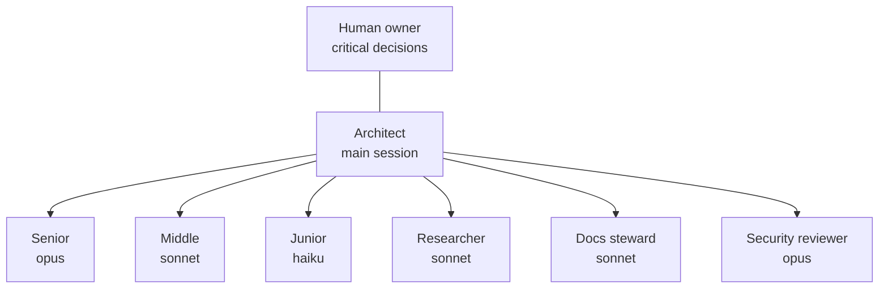
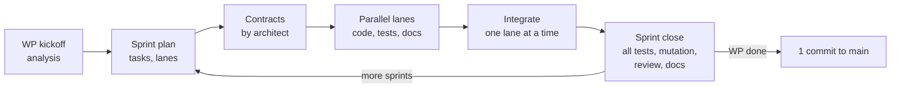

# AI development

Rivqen is built by a team of AI agents under a human owner. This section is the operating manual for that team. The same rules are in the repository for the agents: `AGENTS.md` for every AI tool, and `CLAUDE.md`, `.claude/agents/`, `.claude/skills/` and `.claude/rules/` for Claude Code.

**Status:** <Badge type="info" text="DESIGN" /> in force from WP-24

[[toc]]

## 1. Principles

1. **One architect, many executors.** The main session is the architect. It owns the architecture, the plan, the integration and the final check. Subagents execute tasks.
2. **Right model for the task.** A task goes to the smallest model tier that can do it well: junior, middle or senior.
3. **Contracts first, then parallel work.** The architect fixes interfaces, fixtures and file ownership before agents start. Parallel lanes never edit the same file.
4. **Humans decide the critical things.** API, protocol, security, licenses and scope go to the human. The architect decides the rest and records each decision.
5. **Documentation moves with the code.** A task is not done until the pages it affects are updated.
6. **Few tests, strong tests.** Each behavior has a test. New code is checked with mutation testing. No test exists only to raise a number.
7. **Evidence over opinion.** Facts have sources. Unknown facts are written as `NOT FOUND`.

## 2. Team

| Role | Model tier | Does | Does not |
|---|---|---|---|
| **Architect** | Main session (most capable model available) | Plans sprints, writes contracts, assigns tasks, decides non-critical questions, integrates, runs the final review | Write large code itself; skip a gate |
| **Senior** | `opus` | Concurrency, FFI, `unsafe`, FSM, cache atomicity, security-sensitive parsing, unclear specs, ADR drafts | Change contracts without the architect |
| **Middle** | `sonnet` | One module from a clear spec: implementation, tests, mutation check on its diff | Cross-module design |
| **Junior** | `haiku` | Fully specified, mechanical work: fixtures from a spec, renames, boilerplate, link fixes, test data | Any design choice |
| **Researcher** | `sonnet`, read-only + web | Evidence, sources, tool and standard checks | Write code |
| **Docs steward** | `sonnet` | Shared pages, sidebar, status tables, STE style | Change technical decisions |
| **Security reviewer** | `opus`, read-only | Threat review of a diff, findings with severity | Fix code in the same task |

Details: [Roles and routing](/engineering/ai/roles).

## 3. Life of a work package

| Step | Skill | Page |
|---|---|---|
| WP kickoff | `/wp-start` | [Sprint workflow](/engineering/ai/sprint#_1-wp-kickoff) |
| Sprint plan | `/sprint-plan` | [Sprint workflow](/engineering/ai/sprint#_2-sprint-plan) |
| Run lanes | `/dispatch` | [Parallel work](/engineering/ai/parallel) |
| Decide or escalate | `/decide` | [Decisions](/engineering/ai/decisions) |
| Keep docs current | `/doc-sync` | [Documentation](/engineering/ai/documentation) |
| Mutation check | `/mutation-check` | [Mutation testing](/engineering/quality/mutation) |
| Integrate and close | `/sprint-close` | [Sprint workflow](/engineering/ai/sprint#_6-sprint-close) |
| Code review | `/code-review` | [Sprint workflow](/engineering/ai/sprint#_6-sprint-close) |

## 4. Files in the repository

| Path | Content | Read by |
|---|---|---|
| `AGENTS.md` | Project brief, hard rules, git, commands — tool-neutral ([agents.md](https://agents.md) convention) | Every AI coding tool |
| `CLAUDE.md` | Imports `AGENTS.md` (`@AGENTS.md`); adds subagents, skills and Claude Code specifics | Claude Code sessions and subagents |
| `.claude/agents/*.md` | Subagent roles: model, tools, instructions | Architect when it delegates |
| `.claude/skills/*/SKILL.md` | Procedures: kickoff, plan, dispatch, decide, doc-sync, mutation check, close | Architect and subagents |
| `.claude/rules/*.md` | Short MUST lists per language and topic | Agents that edit matching files |
| `.claude/settings.json` | Shared permissions and hooks | Claude Code |
| `docs/engineering/standards/` | Full coding standards | Humans and agents |
| `docs/engineering/plan/sprints/` | Sprint records: plan, progress, results | Everyone; survives lost sessions |
| `docs/engineering/plan/decision-log.md` | Architect decisions below ADR level | Everyone |

::: tip One source of truth
The standards pages are the full text. The `.claude/rules/` files are short checklists that point to them. When a standards page changes, the matching rules file changes in the same commit.
:::

## Related

- [Roles and routing](/engineering/ai/roles)
- [Sprint workflow](/engineering/ai/sprint)
- [Parallel work](/engineering/ai/parallel)
- [Decisions](/engineering/ai/decisions)
- [Documentation as you go](/engineering/ai/documentation)
- [Coding standards](/engineering/standards/)
