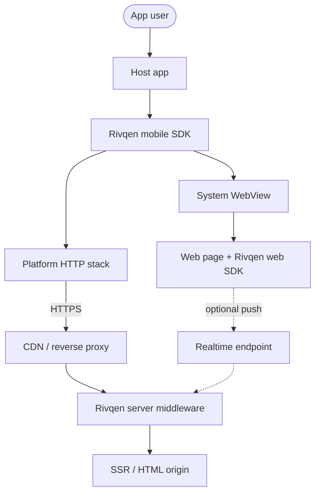
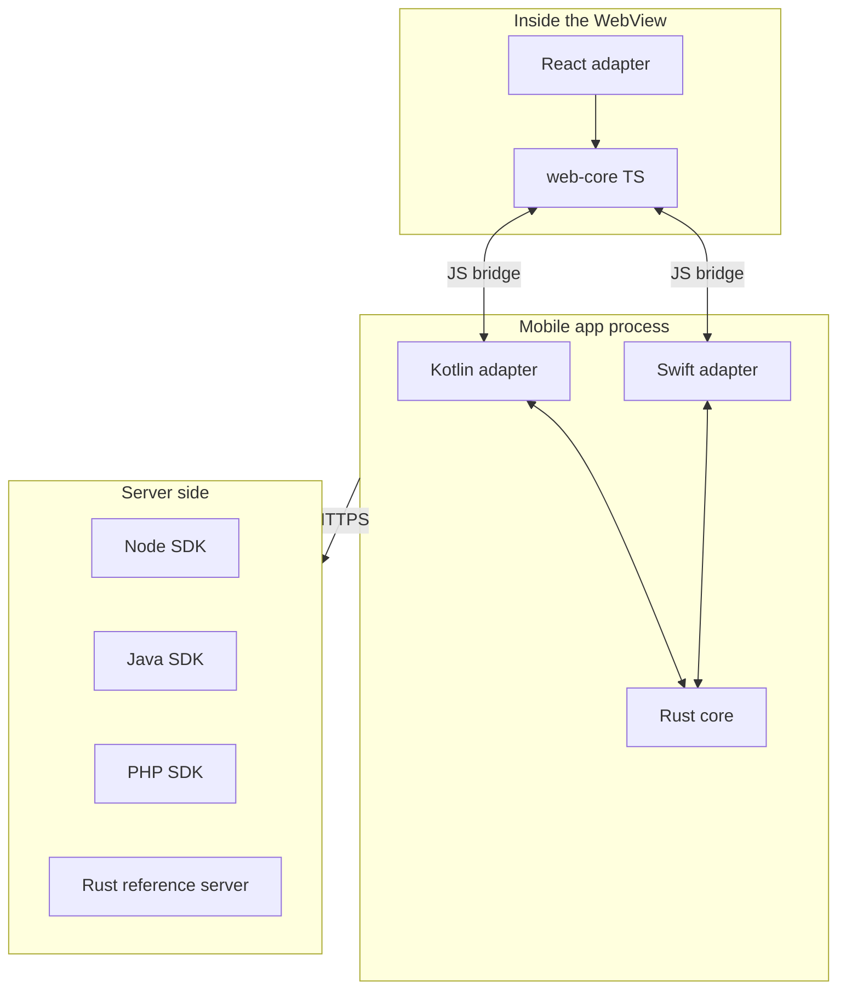
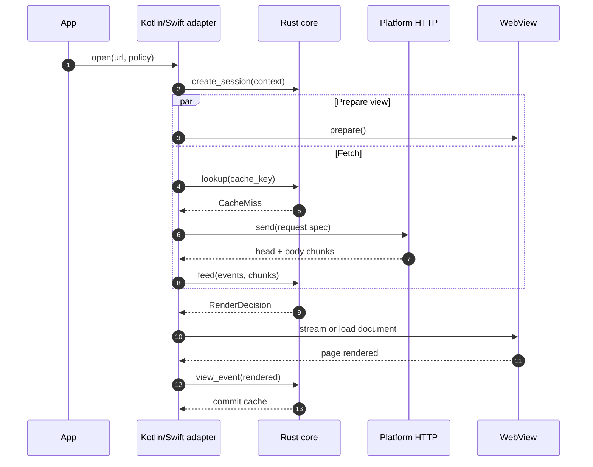

# System overview

This page gives the big picture of Rivqen: the parts, their responsibilities, and how one page load flows through them.

**Status:** <Badge type="info" text="DESIGN" /> The architecture is a proposal. ADR-001 … ADR-012 will confirm or change it.

[[toc]]

## 1. Goal in one paragraph

Rivqen opens HTML pages in mobile apps faster and with less traffic. It starts the HTML request in parallel with the WebView start. It keeps a safe, per-account cache of the page. It splits the page into a stable **template** and changing **data blocks**, so that an update sends only the changed data. If any step fails, Rivqen loads the page with normal HTTPS. It never trades security for speed.

## 2. System context

The diagram shows Rivqen inside a host app and its relation to the server side.

## 3. Building blocks

| Block | Language | Responsibility | Does **not** do |
|---|---|---|---|
| **Rust core** | Rust (stable) | Protocol legacy/RQP logic, session state machine, template/data split, diff validation, cache policy and keys, resource budgets, typed events | Own the UI, own the WebView, own sockets (first iteration), store secrets |
| **Android adapter** | Kotlin | WebView lifecycle, request interception, HTTP via platform stack, cookies, Keystore, JS bridge, main-thread dispatch | Protocol decisions (the core makes them) |
| **iOS adapter** | Swift | WKWebView lifecycle, navigation strategy, URLSession, cookies, Keychain, JS bridge, main-actor dispatch | Private WebKit API, global HTTPS interception |
| **web-core** | TypeScript | Message schema validation, revision checks, safe DOM/state updates, capability detection | Run code from patches, trust message `origin` fields |
| **React adapter** | TypeScript | Provider and hooks, region components, SSR/hydration integration | Patch DOM that React owns |
| **Server SDKs** | Node.js, Java, PHP | Mark templates and data blocks, compute revisions, answer legacy/RQP requests, set cache headers | Change HTML for clients that do not use Rivqen |
| **Rust reference server** | Rust | The oracle for conformance tests | Production traffic (optional sidecar later) |

## 4. One page load (cold start)

The sequence shows a first visit without cache. The HTML request starts **before** the WebView is ready.

## 5. The four outcomes

Every navigation with a cache ends in one of four outcomes. They come from the upstream protocol <Badge type="tip" text="FACT" /> (see [Legacy protocol wire contract](/engineering/protocol/legacy-wire)).

| Outcome | Condition | What the user sees | What travels |
|---|---|---|---|
| **First load** | No cache | Page streams in as it downloads | Full HTML |
| **Not modified** | Server confirms the cached page is current (`304`) | Cached page at once | Headers only |
| **Data update** | Template is the same, data changed | Cached page at once, then changed blocks update | Changed data blocks only |
| **Template change** | Template changed | New full page | Full HTML |

If no outcome is safe, the core selects **Fallback**: a normal HTTPS load with no Rivqen optimization.

## 6. Responsibility split (core vs adapter)

The core is **pure logic**: it receives events and returns actions. The adapters do all I/O. This split makes the core testable with fake clocks and fake transports, and identical on every platform.

| Concern | Core | Adapter |
|---|---|---|
| Decide what to show | ✅ | |
| Send HTTP requests | | ✅ (core returns a `SendHttpRequest` action) |
| Cookies and authentication | | ✅ (platform cookie store) |
| Parse markers, validate diffs | ✅ | |
| Write cache files | ✅ (transaction plan) | ✅ (file I/O, encryption keys) |
| Talk to the WebView | | ✅ |
| Timers and deadlines | ✅ (logic) | ✅ (clock source) |
| Metrics | ✅ (typed events) | ✅ (export) |

<Badge type="info" text="DESIGN" /> In the first iteration the core does **not** own sockets. A native Rust HTTP stack would create a second cookie jar and break authentication consistency with the WebView. A native transport is a later experiment (see [ADR-001](/engineering/architecture/adr/#adr-001)).

## 7. Two product modes

| Mode | Purpose | Guarantee |
|---|---|---|
| **Legacy protocol compatibility** | Work with existing VasSonic legacy protocol servers and pages | Observable parity on golden fixtures. Platform exceptions are documented. |
| **Rivqen protocol** | Typed manifests, revisions, safe patches, modern transports | Explicit capability negotiation and fallback. Not binary-compatible with v1. |

"Compatible" means **functional equivalence**, not bit-identical WebView behavior. Android and iOS have different public APIs and security policies.

## Related

- [Invariants](/engineering/architecture/invariants)
- [Public surfaces](/engineering/architecture/surfaces)
- [Technology stack](/engineering/architecture/technology-stack)
- [ADR index](/engineering/architecture/adr/)
