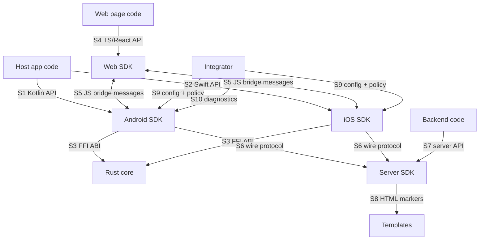

# Public surfaces

A **surface** is any place where Rivqen meets code or systems that it does not control. Each surface is a contract. A change to a surface is a versioned, reviewed change.

**Status:** <Badge type="info" text="DESIGN" /> All surfaces are planned. Names are working names until the API review in WP-05 and WP-17.

[[toc]]

## 1. Surface map

| ID | Surface | Consumers | Versioning | Spec page |
|---|---|---|---|---|
| S1 | Kotlin public API | Android app developers | SemVer of the Android artifact | [Android SDK](/engineering/platforms/android) |
| S2 | Swift public API | iOS app developers | SemVer of the Swift package | [iOS SDK](/engineering/platforms/ios) |
| S3 | Rust core FFI ABI | Rivqen adapters only (internal) | ABI version number, checked at load | [FFI boundary](/engineering/core/ffi) |
| S4 | TypeScript / React API | Web developers | SemVer of npm packages | [Web and React SDK](/engineering/platforms/web-react) |
| S5 | JS bridge message schema | Web SDK ↔ native adapters | `protocol_version` field | [JS bridge contract](/engineering/platforms/js-bridge) |
| S6 | Wire protocol (HTTP headers, bodies) | Clients ↔ servers, CDNs | Legacy protocol (frozen) / Rivqen protocol (negotiated) | [Protocol](/engineering/protocol/) |
| S7 | Server SDK APIs | Backend developers | SemVer per language package | [Server SDKs](/engineering/server/) |
| S8 | HTML template markers | Template authors, SSR | legacy comment markers (frozen) / RQP attributes | [legacy markers grammar](/engineering/protocol/legacy-markers) |
| S9 | Configuration and policy | Integrators | Config schema version | Section 3 below |
| S10 | Diagnostics and metrics | Integrators, SRE | Metric schema version | [Observability](/engineering/quality/observability) |

## 2. Cross-platform functional API

All client SDKs expose the **same functional API**. Names follow each language's style, but the meaning is identical. <Badge type="info" text="DESIGN" />

| Operation | Meaning | Kotlin (planned) | Swift (planned) |
|---|---|---|---|
| `init(config)` | Create an engine with limits and policy | `Rivqen.create(context, config)` | `try RivqenEngine(configuration:)` |
| `open(request)` | Start a session for one navigation | `engine.open(request)` | `try await engine.open(_:)` |
| `observe()` | Stream of typed session events | `session.events: Flow<SessionEvent>` | `session.events: AsyncStream<SessionEvent>` |
| `attach(renderer)` | Connect the session to a WebView | `session.attach(webView)` | `session.attach(to: webView)` |
| `reload(mode)` | `revalidate`, `force`, or `offline` | `session.reload(ReloadMode.Revalidate)` | `session.reload(.revalidate)` |
| `prefetch(plan)` | Warm the cache for known URLs | `engine.prefetch(plan)` | `await engine.prefetch(plan)` |
| `cancel()` | Stop all work of the session | `session.cancel()` | `session.cancel()` |
| `clearCache(partition, url?)` | Remove cache entries | `engine.clearCache(partition)` | `await engine.clearCache(partition:)` |
| `setNetworkPolicy(policy)` | Change data-saver / transport policy | `engine.setNetworkPolicy(p)` | `engine.setNetworkPolicy(_:)` |
| `diagnostics()` | Local version, protocol, capabilities | `engine.diagnostics()` | `engine.diagnostics()` |
| `shutdown()` | Release all resources | `engine.close()` | `await engine.shutdown()` |

Rules:

1. No object holds global user state. The **partition** (account scope) and the **trust policy** are explicit parameters of `open`.
2. Android and iOS versions are released with the same minor version for the same functional API.
3. Each operation documents its thread rules (main thread, any thread, suspending).

## 3. Configuration surface (S9)

<Badge type="info" text="DESIGN" /> One configuration schema is shared by all platforms. Each SDK maps it to a native builder.

| Group | Key | Type | Default | Notes |
|---|---|---|---|---|
| Protocol | `legacy.allowedOrigins` | list of origins | empty | Only with the optional legacy module (until 1.5). |
| Protocol | `protocol.requiredCapabilities` | set of tokens | `{manifest}` | RQP capabilities the app requires; otherwise normal HTTPS. |
| Trust | `trust.allowedOrigins` | list of origins | empty (deny all) | Exact scheme + host + port. |
| Trust | `trust.bridgeOrigins` | list of origins | same as `allowedOrigins` | Origins allowed to use the JS bridge. |
| Cache | `cache.memoryBudgetBytes` | int | device class based | Starting range 8–32 MiB. |
| Cache | `cache.diskBudgetBytes` | int | device class based | Starting range 64–256 MiB. |
| Cache | `cache.authenticatedPages` | enum `off`, `encrypted` | `off` | Caching of authenticated pages is off by default. |
| Cache | `cache.staleWhileRevalidate` | enum `server`, `off` | `server` | Follow the server's `Cache-Control`. |
| Network | `network.timeouts` | connect, first byte, total | 5 s / 10 s / 30 s (initial) | Tune after benchmarks. |
| Network | `network.realtime` | enum `off`, `websocket`, `webtransport` | `off` | Experimental transports are opt-in. |
| Network | `network.dataSaver` | enum `system`, `on`, `off` | `system` | Respect the OS data-saver setting. |
| Limits | `limits.maxDocumentBytes` | int | 5 MiB (initial) | See [Resource limits](/engineering/core/resource-limits). |
| Limits | `limits.maxPatchBytes` | int | 256 KiB (initial) | |
| Privacy | `telemetry.export` | enum `off`, `host` | `off` | No telemetry leaves the device unless the host app exports it. |
| Privacy | `identity.sdkHeader` | bool | `false` | No SDK-identifying header by default. |
| Safety | `killSwitch.disabledOrigins` | list | empty | Disable Rivqen per origin at runtime. |

Numbers marked "initial" are starting values for tests. They are not promises. Benchmarks in WP-19 set the final defaults.

## 4. Stability rules

| Surface | Breaking change policy |
|---|---|
| S1, S2, S4, S7 | SemVer. Breaking changes only in a major version, with a migration guide. Deprecate for at least one minor version first. |
| S3 | Internal. The adapter and the core ship together. The core checks the ABI version at load and refuses a mismatch. |
| S5 | Each message has `protocol_version`. The receiver rejects unknown major versions and ignores unknown optional fields. |
| S6 legacy protocol | **Frozen.** Rivqen never changes legacy behavior. Fixes for unsafe legacy behavior are opt-in profiles, documented in [Divergences](/engineering/protocol/legacy-divergences). |
| S6 Rivqen protocol | Capability negotiation. New capabilities are additive. A removed capability needs a new protocol major version. |
| S8 | Legacy markers frozen and removed in 1.5. RQP markup versioned with the protocol. |
| S9 | Config schema version. Unknown keys are an error in strict mode and a warning in lenient mode. |
| S10 | Metric names are stable after 1.0. New metrics are additive. |

## Related

- [Core API](/engineering/core/api)
- [Data model](/engineering/core/data-model)
- [Versioning and downgrade](/engineering/protocol/versioning)
