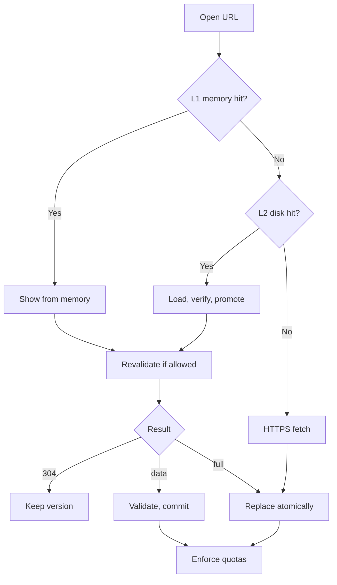

# Cache layers

The cache lets Rivqen show a page at once and send only what changed. This section defines what is cached, where, for how long, and for whom.

**Status:** <Badge type="info" text="DESIGN" />

[[toc]]

## 1. What changes compared with upstream

| | Upstream VasSonic <Badge type="tip" text="FACT" /> | Rivqen <Badge type="info" text="DESIGN" /> |
|---|---|---|
| Stored parts | HTML, template and data files per session id, plus metadata in a database | Same parts, plus a manifest with revisions and integrity |
| Identity | Session id = MD5 of host + path + only `sonic_*` query parameters (other parameters ignored) | Partition + origin + full canonical URL + variant (see [Cache identity](/engineering/cache/identity)) |
| Freshness | Validators (`etag`, `template-tag`) and legacy `cache-offline` | RFC 9111 rules + legacy `cache-offline` in legacy mode only |
| Writes | File writes | Atomic transaction: temp file → fsync → rename + metadata transaction |
| Accounts | Optional account prefix in clear text (`IS_ACCOUNT_RELATED`, default on); no `no-store` check by default | Mandatory keyed-hash partition; `no-store` always wins; authenticated caching off by default |
| Private data | Plain files | Encryption for authenticated entries (ADR-011) |

## 2. Layers

| Layer | Role | Budget (initial) | Notes |
|---|---|---|---|
| **L0** active session | Snapshot currently on screen | Bounded by session | Freed when the session ends |
| **L1** memory (Rust) | Hot templates, data, metadata | 8–32 MiB per app | Shrinks on memory pressure |
| **L2** private disk | Atomic HTML/template/data/manifest | 64–256 MiB per app | Encrypted for authenticated entries |
| WebView HTTP cache | Subresources (CSS, JS, images) | Managed by the WebView | Rivqen does not duplicate it without benefit |
| Offline package | Versioned set of trusted resources | Per manifest | Only from trusted origins with integrity |

## 3. Rules

| ID | Rule |
|---|---|
| `R-CACHE-01` | The cache key includes the partition. See [Cache identity](/engineering/cache/identity). |
| `R-CACHE-02` | `Cache-Control: no-store` always wins. Rivqen never stores such a response. |
| `R-CACHE-03` | Authenticated pages are not cached unless the app policy **and** the server allow it. Then they are encrypted. |
| `R-CACHE-04` | Logout or account switch revokes the partition at once: memory entries, disk entries, keys, bridge, subscriptions. |
| `R-CACHE-05` | A commit is atomic. After any crash, the entry is the old valid version or the new valid version. |
| `R-CACHE-06` | A corrupt entry is deleted and does not affect other entries. |
| `R-CACHE-07` | Concurrent identical requests in the same partition are deduplicated. Different partitions never share a response. |
| `R-CACHE-08` | Legacy `cache-offline` values apply **only** in legacy mode. |

## 4. Acceptance test

<Badge type="danger" text="GATE" /> After a process kill, a corrupt manifest, a full disk, a concurrent update and a logout, the client either opens the **correct** allowed cached version, or loads the page safely from the network. Data of another account never appears, not even for one frame.

## Pages in this section

- [Cache identity](/engineering/cache/identity)
- [Freshness and invalidation](/engineering/cache/policy)
- [Storage and memory](/engineering/cache/storage)
