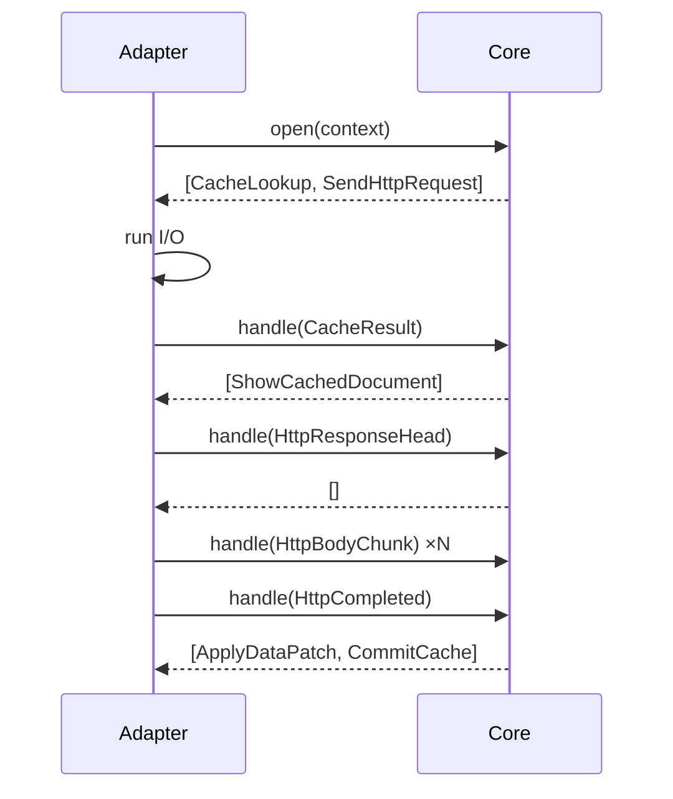

# Core API

This page defines how adapters call the Rust core. The core is a deterministic **event → action** machine. It has no hidden threads and no I/O.

**Status:** <Badge type="info" text="DESIGN" /> The Rust code below is a design sketch, not a final signature.

[[toc]]

## 1. Shape of the API

```rust
// Planned API — not released
pub struct Engine { /* config, limits, stores */ }
pub struct SessionHandle { /* opaque id + generation */ }

impl Engine {
    pub fn new(config: EngineConfig) -> Result<Engine, RivqenError>;
    pub fn open(&self, ctx: RequestContext) -> Result<(SessionHandle, Vec<Action>), RivqenError>;
    pub fn handle(&self, s: &SessionHandle, event: Event) -> Result<Vec<Action>, RivqenError>;
    pub fn cancel(&self, s: &SessionHandle) -> Vec<Action>;
    pub fn on_partition_changed(&self, p: PartitionId) -> Vec<Action>;
    pub fn on_memory_pressure(&self, level: PressureLevel) -> Vec<Action>;
    pub fn diagnostics(&self) -> Diagnostics;
    pub fn shutdown(self) -> Vec<Action>;
}
```

Each call returns a list of [actions](/engineering/core/data-model#_5-events-and-actions). The adapter executes them and reports results as new events.

## 2. The event loop contract

The diagram shows the loop between an adapter and the core.



Rules:

1. The adapter calls the core for one session **from one logical thread at a time**. The core is `Send` but session methods are not re-entrant.
2. The adapter executes actions **in the order** the core returns them.
3. The adapter reports the result of each I/O action as an event with the same `request_id`.
4. An event with an old `generation` returns an empty action list. It is not an error.
5. `cancel` is idempotent. After `cancel`, every event for that session returns an empty list.
6. The core never blocks. Long work (parsing a large document) is split into chunks by the stream API.

## 3. Outcomes

`Outcome` tells the adapter and the app what happened to a navigation.

| Outcome | Meaning | Upstream analogue (legacy) |
|---|---|---|
| `FirstLoad` | No cache. Full document from network. | First load |
| `CacheHitNotModified` | Cached document is current. | `304` |
| `DataUpdated` | Same template, data blocks updated. | Data change |
| `TemplateChanged` | New template, full reload. | Template change |
| `ServedStale` | Cached document shown under `stale-while-revalidate` or offline policy. | `cache-offline` cases |
| `Fallback(reason)` | Normal HTTPS load. | Error / `cache-offline: http` |

The upstream result codes map to these outcomes in [legacy client behavior](/engineering/protocol/legacy-client).

## 4. Threading per platform

| Platform | Who calls the core | Where actions run |
|---|---|---|
| Android | A single-threaded coroutine dispatcher per engine (`limitedParallelism(1)`) | WebView actions on the main thread; I/O on `Dispatchers.IO` |
| iOS | A Swift `actor` that owns the engine | WebView actions on `@MainActor`; I/O in `URLSession` tasks |
| Tests | The test thread | Fake transport and fake clock |

## 5. Verification

- Property test: for any sequence of events, the core never returns an action for a cancelled session.
- Property test: for any interleaving of `HttpBodyChunk` and `WebViewReady`, the final rendered bytes equal the network bytes.
- Golden test: each legacy fixture produces the expected action list (`expected.actions.json`).

## Related

- [Data model](/engineering/core/data-model)
- [FFI boundary](/engineering/core/ffi)
- [Errors](/engineering/core/errors)
