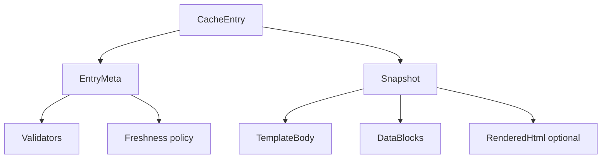

# Data model

This page defines the main data structures of the Rust core. Adapters, fixtures and tests use the same names.

**Status:** <Badge type="info" text="DESIGN" /> Field names can change in WP-05. The meaning of each field is the contract.

[[toc]]

## 1. Identifiers

| Type | Format | Meaning | Rules |
|---|---|---|---|
| `SessionId` | 128-bit random, opaque | One navigation session | Never reused. Not derived from the URL. |
| `Generation` | `u64`, monotonic per session | Version of the session state | Increments on reload, account change, cancel. Events with an old generation are ignored. |
| `RequestId` | `u64`, monotonic per engine | One HTTP request or channel message | Correlates actions and events. |
| `NavigationId` | opaque string | One navigation as seen by the page | Sent to the web SDK in bridge messages. |
| `PartitionId` | 256-bit keyed hash | Account / tenant / environment scope | Computed by the adapter from non-secret IDs and a device key. Never a token. |
| `CacheKey` | 256-bit hash | One cache entry | See [Cache identity](/engineering/cache/identity). |
| `Revision` | opaque string, ≤ 128 bytes | Version of a page or template | legacy: derived from `etag` / `template-tag`. RQP: server-issued. |
| `V1SessionKey` | string | Upstream-compatible session/cache id derived from the URL | Only in legacy mode. See [legacy client behavior](/engineering/protocol/legacy-client). |

## 2. Request context

`RequestContext` is the input to `open`. The adapter builds it. The core never reads platform state directly.

| Field | Type | Notes |
|---|---|---|
| `url` | `SafeUrl` | Parsed, normalized, `https` only (or `http` for `localhost` in debug builds). |
| `method` | enum | `GET` only for document sessions. |
| `partition` | `PartitionId` | Required. There is no default partition for authenticated pages. |
| `policy` | `SessionPolicy` | Protocol modes, cache rules, timeouts, limits for this session. |
| `trust` | `TrustPolicy` | Allowed origins, bridge origins, downgrade rules. |
| `capabilities` | `PlatformCapabilities` | What the adapter and WebView can do (streaming, H3, WebSocket…). |
| `clock` | handle | Injected time source (fake in tests). |

## 3. Cache objects

| Type | Fields (main) | Notes |
|---|---|---|
| `CacheEntry` | `key`, `meta`, `snapshot_ref` | One logical page in one partition. |
| `EntryMeta` | `created_at`, `last_validated_at`, `expires_at`, `validators`, `policy`, `size`, `schema_version` | Stored in the metadata database. |
| `Validators` | `etag`, `template_tag`, `last_modified`, `v2_revision`, `v2_template_revision` | legacy and RQP fields are separate. |
| `Snapshot` | `template`, `data`, `rendered_html?`, `integrity` | Immutable once committed. |
| `TemplateBody` | bytes + `template_revision` | Template with placeholders. |
| `DataBlocks` | ordered map `block_id → BlockValue` | Order is significant for re-rendering. |
| `BlockValue` | `Html(bytes)` or `Json(value)` | legacy supports `Html` only. |
| `CacheTransaction` | list of writes + new meta + old snapshot ref | Applied atomically by the adapter's storage driver. |

## 4. Protocol objects

### 4.1 legacy protocol

| Type | Fields | Notes |
|---|---|---|
| `V1Request` | `accept_diff`, `if_none_match`, `template_tag`, `sdk_marker?`, cookies (by adapter) | Headers exactly as specified in [legacy wire contract](/engineering/protocol/legacy-wire). |
| `V1ResponseHead` | `status`, `etag?`, `template_tag?`, `template_change?`, `cache_offline?`, `content_type`, `csp?` | Parsed, not trusted. |
| `V1DataResponse` | `data: map<key, html>`, `template_tag`, `html_sha1?`, `diff?` | Body of a data-only response. |

### 4.2 Rivqen protocol

| Type | Fields | Notes |
|---|---|---|
| `Capabilities` | set of tokens | Negotiated per request. |
| `PageManifest` | `protocol`, `origin`, `path`, `template_revision`, `page_revision`, `base_revision?`, `blocks[]`, `policy`, `limits` | See [RQP manifest and patch](/engineering/protocol/manifest-patch). |
| `BlockDescriptor` | `id`, `format` (`html`/`json`), `sha256` | Hash over canonical bytes. |
| `PatchEnvelope` | `type`, `protocol`, `page_id`, `base_revision`, `next_revision`, `template_revision`, `sequence`, `operations[]` | Validated before apply. |
| `PatchOp` | `replace_block`, `remove_block`, `insert_block` | No operation can carry executable code. |

## 5. Events and actions

The core is an event-driven state machine. The adapter sends **events**. The core returns **actions**.

| Event | Sent when |
|---|---|
| `WebViewReady` | The WebView can accept a document. |
| `CacheResult(snapshot?)` | The storage driver finished a lookup. |
| `HttpResponseHead(meta)` | Status and headers arrived. |
| `HttpBodyChunk(chunk)` | A body chunk arrived (bounded size). |
| `HttpCompleted` / `HttpFailed(error)` | The body ended or failed. |
| `BridgeReady` | The web SDK in the page connected. |
| `PageRendered` | The page reported first useful render. |
| `NavigationCancelled` | The user or app left the page. |
| `PartitionChanged` | The account changed (logout, switch). |
| `MemoryPressure(level)` | The OS asked to reduce memory. |
| `Tick(now)` | Timer event from the adapter's clock. |

| Action | The adapter must |
|---|---|
| `SendHttpRequest(spec)` | Send this request with the platform stack. |
| `ShowCachedDocument(ref)` | Load this cached document into the WebView. |
| `StreamDocument(token)` | Feed the document stream to the WebView. |
| `ApplyDataPatch(validated)` | Deliver this validated patch to the web SDK. |
| `CommitCache(txn)` | Execute this cache transaction atomically. |
| `InvalidateCache(key)` | Remove this entry. |
| `LoadNormally(url)` | Fall back to a normal WebView load. |
| `EmitMetric(metric)` | Record this metric locally. |
| `ScheduleTimer(deadline)` | Send a `Tick` at this time. |

## 6. Serialization

| Data | Format | Canonical form |
|---|---|---|
| Fixtures | JSON + raw HTTP files | UTF-8, LF line ends, sorted keys in JSON |
| RQP manifest and patch | JSON | Defined by JSON Schema in WP-17; hashes over canonical block bytes, not over JSON text |
| Cache metadata | SQLite rows | `schema_version` column; migrations are forward-only |
| FFI payloads | Generated bindings (UniFFI) or C structs | See [FFI boundary](/engineering/core/ffi) |

## Related

- [Core API](/engineering/core/api)
- [Session state machine](/engineering/core/session-fsm)
- [Cache identity](/engineering/cache/identity)
