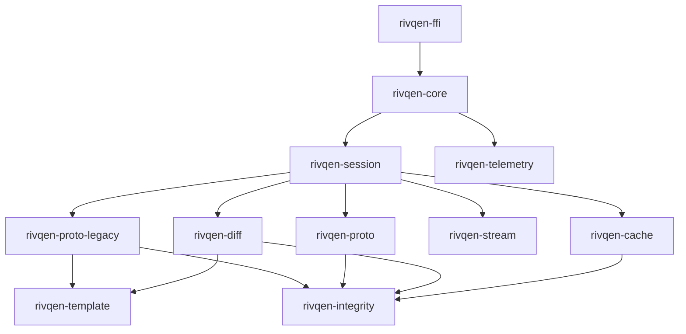

# Rust core: crate map

The Rust core is the single implementation of Rivqen's logic for Android and iOS. This page lists the crates, their responsibilities and their dependency order.

**Status:** <Badge type="info" text="DESIGN" /> Crate names are working names. WP-05 creates the workspace.

[[toc]]

## 1. Why Rust, and why only logic

| Question | Answer |
|---|---|
| Why one core? | Upstream VasSonic implements the same protocol separately in Java (Android) and Objective-C (iOS). Two implementations drift. One core gives one behavior. |
| Why Rust? | Memory safety without a garbage collector, predictable performance, mature cross-compilation to Android and iOS, and strong testing tools (property tests, fuzzing, Miri). |
| Why not a Rust WebView? | The core moves only **deterministic Rivqen logic** into Rust. Blink and WebKit stay the platform engines. The core never calls private APIs and never owns the UI lifecycle. |
| Why not Rust HTTP? | The WebView and the HTTP request must share cookies and authentication. The platform HTTP stack keeps them consistent. See [ADR-001](/engineering/architecture/adr/#adr-001). |

## 2. Crates

| Crate | Responsibility | Depends on | Upstream equivalent (for orientation) |
|---|---|---|---|
| `rivqen-core` | Public facade: `Engine`, `Session`, configuration, event loop | all below | `SonicEngine` |
| `rivqen-session` | Session state machine, deadlines, generations, cancellation, race handling | `proto-*`, `cache`, `stream`, `diff` | `SonicSession`, `QuickSonicSession`, `StandardSonicSession` |
| `rivqen-proto-legacy` | Legacy protocol headers, normalization, decision tree, response parsing | `template`, `integrity` | Header handling in client and servers |
| `rivqen-proto` | Rivqen protocol typed messages, capability negotiation, schemas | `integrity` | — (new) |
| `rivqen-template` | Strict, bounded parser for data-block markers; template/data split; serializer | — | Marker regex code in clients and servers |
| `rivqen-diff` | Data diff, patch validation, base-revision check, atomic apply plan | `template`, `integrity` | Data-diff code in clients |
| `rivqen-cache` | Cache keys, partitions, policy (RFC 9111 + legacy), snapshots, transactions, quotas | `integrity` | `SonicCacheInterceptor`, `SonicDataHelper` |
| `rivqen-stream` | Bounded chunk buffers, backpressure, split of cached prefix + network rest | — | `SonicSessionStream` |
| `rivqen-integrity` | SHA-1 (legacy compatibility only), SHA-256 (RQP), revision identifiers | — | SHA-1 helpers |
| `rivqen-ffi` | Stable, minimal ABI for Kotlin and Swift; handle lifetimes | `core` | — |
| `rivqen-telemetry` | Typed metrics and spans with privacy redaction | — | Statistics callbacks |
| `rivqen-testkit` | Fixtures loader, fake clock, fake transport, property-test generators | all (dev) | — |

## 3. Dependency graph

The graph shows compile-time dependencies. Arrows point from a crate to the crates it uses. There are no cycles.

## 4. Core rules

| ID | Rule |
|---|---|
| `R-CORE-01` | No WebView class, UIKit, Android `Context`, JS runtime or UI thread enters the core. |
| `R-CORE-02` | The core receives a `RequestContext` with a normalized URL, partition, policy, and explicit HTTP and cache events. |
| `R-CORE-03` | No hidden global singletons. Engine and session creation and shutdown are deterministic. |
| `R-CORE-04` | `SessionId` is unique. Every event carries `generation` and `request_id`. |
| `R-CORE-05` | An invalid diff is **never** applied. Validate first, then commit. |
| `R-CORE-06` | Every async operation is cancelled when the WebView closes or the account changes. No completion touches a destroyed UI. |
| `R-CORE-07` | Errors are typed. See [Errors](/engineering/core/errors). |
| `R-CORE-08` | The API returns `Result<Outcome, RivqenError>` with a `fallback_hint`. Errors never contain secrets. |
| `R-CORE-09` | All parsers support property-based tests and fuzzing, and have formal size limits. |
| `R-CORE-10` | `unsafe` code is forbidden by default (`#![forbid(unsafe_code)]`), except in `rivqen-ffi`. Every `unsafe` block there has a `// SAFETY:` comment, an ADR, Miri or sanitizer coverage where possible, and a security review. |
| `R-CORE-11` | The core does not panic across the FFI boundary. Panics are caught at the boundary and converted to an error. |
| `R-CORE-12` | The core does not start threads on its own. The adapter provides the executor or calls the core synchronously. |

## 5. Pages in this section

| Page | Content |
|---|---|
| [Data model](/engineering/core/data-model) | Core types: identifiers, context, snapshots, manifests, patches |
| [Core API](/engineering/core/api) | Events in, actions out; the event loop contract |
| [Session state machine](/engineering/core/session-fsm) | States, transitions, Quick and Standard compatibility modes |
| [Template engine](/engineering/core/template-engine) | Marker parsing, template/data split, hashing |
| [Diff engine](/engineering/core/diff-engine) | Data diff, patch validation, atomic apply |
| [Streaming](/engineering/core/streaming) | Chunk buffers, backpressure, cached prefix + network rest |
| [FFI boundary](/engineering/core/ffi) | Ownership, threading, panics, ABI versioning |
| [Errors](/engineering/core/errors) | Error taxonomy and fallback hints |
| [Resource limits](/engineering/core/resource-limits) | Budgets for memory, size, time, concurrency |
| [Dependencies](/engineering/core/dependencies) | Candidate crates and their licenses |
