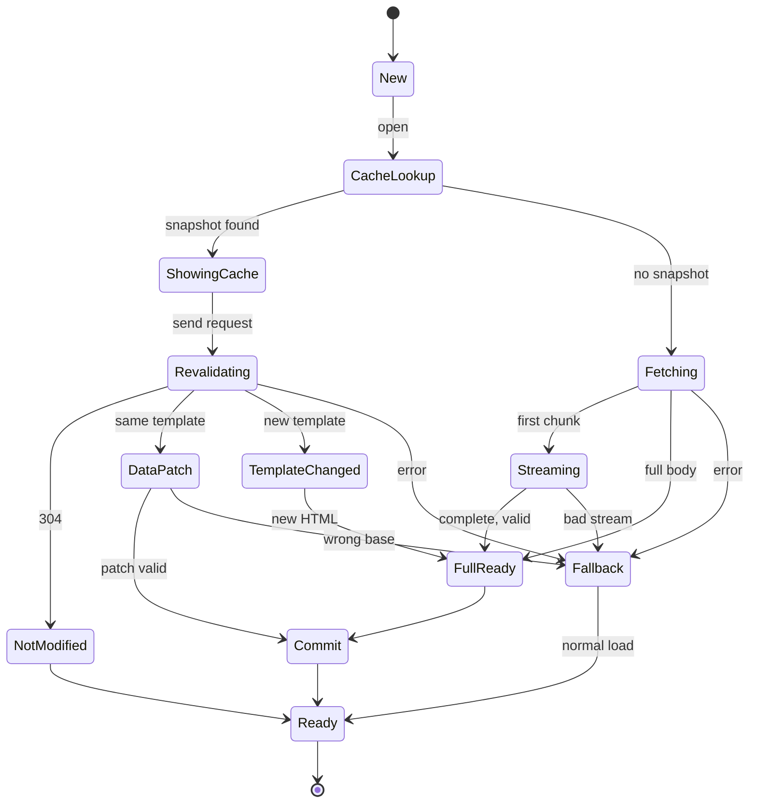

# Session state machine

The session state machine (`rivqen-session`) decides, for one navigation, what to show and when. It is deterministic: the same events in the same order give the same actions.

**Status:** <Badge type="info" text="DESIGN" /> Based on the upstream flow documented in [legacy client behavior](/engineering/protocol/legacy-client).

[[toc]]

## 1. States

| State | Meaning | Exit conditions |
|---|---|---|
| `New` | Created, nothing started | `open` |
| `CacheLookup` | Waiting for the storage driver | `CacheResult` |
| `ShowingCache` | Cached snapshot delivered to the WebView | Request sent |
| `Fetching` | Request sent, no body yet (cold path) | First chunk, full body, error, timeout |
| `Streaming` | Body chunks flow to the WebView | Completion, truncation, cancel |
| `Revalidating` | Conditional request for a cached page | Status and headers decide |
| `NotModified` | Server confirmed the snapshot | Metadata update |
| `DataPatch` | Data update validated or being validated | Commit or fallback |
| `TemplateChanged` | Full new document needed | New document ready |
| `FullReady` | A complete, validated document exists | Commit |
| `Commit` | Cache transaction planned and executed | Done |
| `Fallback` | Normal HTTPS load requested | WebView loads normally |
| `Ready` | The UI operation for this generation is finished | Close, reload, cancel |

## 2. Rules

| ID | Rule |
|---|---|
| FSM-01 | Only `reload`, `cancel` and a partition change increment the **generation**. Normal state changes do not. |
| FSM-02 | Every event carries `generation`; events of an older generation are ignored. |
| FSM-03 | `Ready` means the UI operation for this generation is done. Background revalidation is a **separate operation** with its own request id. |
| FSM-04 | `cancel` from any state goes to the terminal state and returns cleanup actions (close streams, drop buffers). |
| FSM-05 | Every non-terminal state has a deadline. A missed deadline is an event (`Tick`) that leads to `Fallback`. |
| FSM-06 | `Fallback` is always reachable and always ends in a normal load. |
| FSM-07 | A commit happens only from `FullReady` or a validated `DataPatch`. |

## 3. Mapping to upstream modes

| Upstream | Rivqen |
|---|---|
| Quick mode | Policy `presentation = quick`: show cached or rebuilt HTML directly when the WebView is ready; deliver data updates through the bridge after load. On Android, Rivqen keeps response security headers (see U-05). |
| Standard mode | Policy `presentation = standard`: always navigate normally; answer the main document request from the session (intercepted stream). |
| `cache-offline: http` | `Fallback(ServiceUnavailable)` + per-origin disable timer (default 6 h) |
| Result codes 1000 / 2000 / 200 / 304 | Outcomes `FirstLoad` / `TemplateChanged` / `DataUpdated` / `CacheHitNotModified`, mapped in the compatibility shim |

## 4. Races

The core must give the same final result for every interleaving of these events:

| Event A | Event B | Required result |
|---|---|---|
| `WebViewReady` | `HttpCompleted` | Same bytes rendered; one cache commit |
| `HttpResponseHead(304)` | `ShowCachedDocument` not yet executed | Cached page shown once; no reload |
| Data update ready | Page not yet loaded | Rebuilt page loaded directly; no separate patch |
| Data update ready | Page loaded | Patch delivered through the bridge |
| `cancel` | Any I/O completion | No action after cancel |
| `PartitionChanged` | Any event | Session stops; snapshot of the old partition never shown again |

These are property tests in `rivqen-testkit` (random interleavings, fixed seeds in CI).

## Related

- [Core API](/engineering/core/api)
- [Streaming](/engineering/core/streaming)
- [legacy client behavior](/engineering/protocol/legacy-client)
