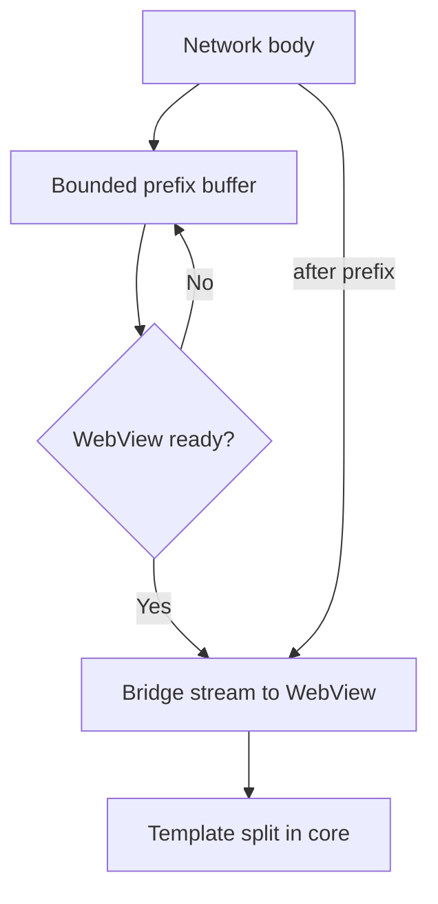

# Streaming

Streaming lets the WebView start to parse and render HTML before the full document arrives. This page defines how the core and the adapters move document bytes with bounded memory.

**Status:** <Badge type="info" text="DESIGN" /> <Badge type="warning" text="RESEARCH" /> Copy cost across FFI must be measured (WP-04).

[[toc]]

## 1. The upstream idea

<Badge type="tip" text="FACT" /> Upstream VasSonic on Android starts the network read before the WebView is ready. When the WebView asks for the main document, the SDK returns a stream that first replays the bytes already read into memory, then continues with the rest of the live network stream. See [legacy client behavior](/engineering/protocol/legacy-client).

Rivqen keeps this behavior and adds limits, cancellation and metrics.

## 2. The bridge stream

The diagram shows how the document bytes flow when the network is faster than the WebView start.

| Phase | Behavior |
|---|---|
| Before WebView ready | Read network chunks into the prefix buffer, up to `limits.prefixBufferBytes`. When the buffer is full, stop reading (backpressure). |
| WebView asks for the document | Return a stream: prefix bytes first, then live network chunks. |
| During streaming | Each chunk also goes to the core (by reference when possible) for template split and integrity. |
| Completion | The core validates the full document, then commits the cache. |
| Cancel | The adapter closes the network stream and the WebView stream. The core drops the buffer. |

## 3. Chunk API

| Rule | Detail |
|---|---|
| Chunk size | 8–64 KiB (tunable). One chunk ≤ `limits.maxChunkBytes`. |
| Ownership | Each chunk has exactly one owner at a time. After the adapter hands a chunk to the core, the adapter does not use it. |
| Pull model | The consumer requests the next chunk. This gives natural backpressure. |
| Copies | Count copied bytes in the `ffi_copy_bytes` metric. Do not claim "zero copy" without a measurement. |
| Order | Chunks carry a sequence number. Out-of-order chunks are a protocol error. |

## 4. Platform constraints

| Platform | Mechanism | Constraint |
|---|---|---|
| Android | `WebViewClient.shouldInterceptRequest` returns a `WebResourceResponse` with an `InputStream` <Badge type="tip" text="FACT" /> | The callback runs on a WebView background thread; the stream read blocks that thread. Redirects and some headers need care. |
| iOS | No public interception of `https` main-frame loads in `WKWebView` <Badge type="tip" text="FACT" /> | True streaming of a fetched main document may be impossible. See [iOS SDK](/engineering/platforms/ios) and ADR-003. |
| Web | Browser does the streaming | The web SDK does not stream documents; it applies updates. |

## 5. Verification

- Property test: the bytes the WebView receives equal the bytes from the network, for any chunk sizes and any timing of `WebViewReady`.
- Fault test: a truncated network stream leads to `Fallback`, and no cache commit.
- Memory test: peak buffer size ≤ `prefixBufferBytes + maxChunkBytes` under a slow WebView.

## Related

- [FFI boundary](/engineering/core/ffi)
- [Resource limits](/engineering/core/resource-limits)
- [ADR-009](/engineering/architecture/adr/#adr-009)
