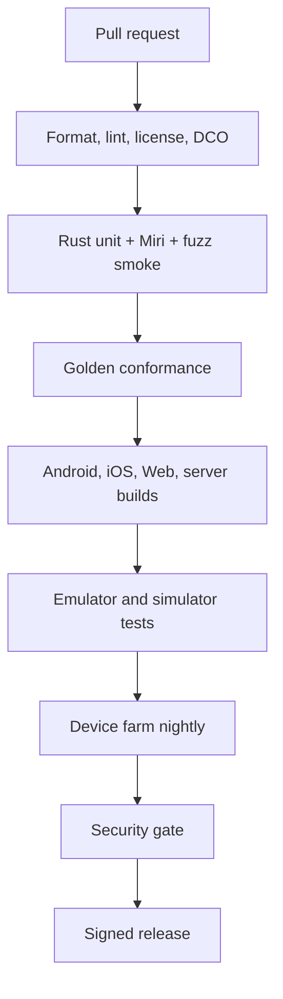

# CI/CD

This page defines the build, test and release pipeline. Two workflows exist today: the documentation workflow (`.github/workflows/docs.yml`) and the fast checks (`.github/workflows/checks.yml`).

**Status:** <Badge type="info" text="DESIGN" /> for code pipelines. <Badge type="tip" text="FACT" /> for the docs workflow (it exists in the repository).

[[toc]]

## 1. Pipeline

The diagram shows the stages that every code change passes.

## 2. Checks per ecosystem

| Ecosystem | Checks |
|---|---|
| Rust | `cargo fmt --check`, `cargo clippy -D warnings`, `cargo nextest run` + `cargo test --doc`, `cargo deny check` (licenses, bans, advisories, sources), Miri on `rivqen-ffi`, fuzz smoke (60 s per target), coverage |
| Kotlin | ktlint/detekt, Android Lint, unit tests, instrumented WebView tests, Gradle dependency verification |
| Swift | SwiftLint, XCTest / Swift Testing, build for device and simulator |
| TypeScript | `tsc --noEmit`, ESLint, Vitest, Playwright tests |
| Java | Build + tests on supported JDKs |
| PHP | PHPStan, PHPUnit on supported PHP versions |
| All | DCO check, license header check (REUSE), secret scanning, SBOM generation, mutation check on the PR diff ([Mutation testing](/engineering/quality/mutation)) |

## 3. Supply chain

| Practice | Tool / standard |
|---|---|
| Lockfiles committed | `Cargo.lock`, `package-lock.json`, Gradle lockfiles, `Package.resolved`, `composer.lock` |
| License policy | `cargo-deny`, license checker per ecosystem; allowlist in [Third-party dependencies](/legal/third-party) |
| Vulnerability scanning | RustSec, GitHub Dependabot alerts, OSV-Scanner |
| SBOM | CycloneDX or SPDX per artifact |
| Provenance | SLSA build provenance via GitHub artifact attestations |
| Signing | Sigstore for npm/Rust; GPG for Maven Central; Apple code signing for XCFramework |
| Pinned actions | Third-party actions pinned by commit SHA in release workflows |
| Least privilege | `permissions:` set per job; no long-lived secrets where OIDC works |

## 4. Documentation workflow (exists)

| Trigger | Result |
|---|---|
| Pull request touching `docs/` | Build only; the PR shows a failure if the site does not build or a link is dead |
| Push to `main` | Build and deploy to GitHub Pages |
| Manual run | Same as push |

## 5. Checks workflow (exists)

| Job step | What it checks |
|---|---|
| Server demo tests | `examples/server-demo`: `npm ci && npm test` |
| Mutation helper tests | `tools/mutation`: `node --test` |
| AI rules point to existing pages | Every `docs/…md` path in `.claude/rules/*.md` exists |

Runs on every pull request, on push to `main`, and manually. Each WP that adds a language package adds its checks here (the tool versions are on the [standards](/engineering/standards/) pages).

## Related

- [Release and packaging](/engineering/delivery/release)
- [Documentation site](/engineering/delivery/docs-site)
