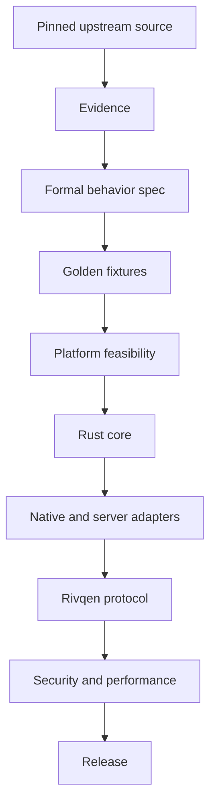

# Engineering handbook

This is **Layer 2** of the Rivqen documentation. It is for people who design, build, test and release Rivqen. If you want to use Rivqen in an app, go to the [Guide](/guide/).

::: warning Documentation phase
No production code exists yet. These pages are the **specification and plan** for the code. Each statement has a [status label](/engineering/style-guide#_2-status-labels). Treat <Badge type="info" text="DESIGN" /> as a proposal that an ADR can change.
:::

## How the engineering docs are organized

The engineering layer has eleven areas. Each area maps to one or more [work packages](/engineering/plan/work-packages).

| Area | What it defines | Main work packages |
|---|---|---|
| [Architecture](/engineering/architecture/) | System context, invariants, public surfaces, technology stack, ADRs | WP-00 |
| [Rust core](/engineering/core/) | Crates, data model, API, state machine, template and diff engines, streaming, FFI, errors, limits | WP-05 … WP-09 |
| [Protocol](/engineering/protocol/) | Legacy protocol compatibility contract, Rivqen protocol wire format, versioning, golden fixtures | WP-01, WP-02, WP-17 |
| [Transport](/engineering/transport/) | HTTP/1.1–3 stacks per platform, WebSocket and WebTransport channels | WP-16 |
| [Cache](/engineering/cache/) | Cache layers, cache identity, freshness, storage, memory | WP-07 |
| [Platforms](/engineering/platforms/android) | Android, iOS, Web/React SDKs and the JS bridge | WP-10 … WP-12 |
| [Server SDKs](/engineering/server/) | Node.js, Java, PHP middleware; CDN rules; conformance | WP-03, WP-13 … WP-15 |
| [Security](/engineering/security/) | Threat model, controls, platform hardening, release profiles, crypto, vulnerability management | WP-18 |
| [Quality](/engineering/quality/testing) | Test strategy, benchmarks, observability | WP-19 |
| [Delivery](/engineering/delivery/repository) | Repository layout, CI/CD, release and packaging, docs site | WP-20, WP-21 |
| [Plan and governance](/engineering/plan/roadmap) | Phases, work packages, gates, risks, open questions, AI-agent workflow | WP-00 |

## The project formula

Rivqen follows one order of work. Do not change the order to get a faster "working SDK".

## Read in this order

If you are new to the project, read these pages in this order:

1. [System overview](/engineering/architecture/) — the big picture in 10 minutes.
2. [Invariants](/engineering/architecture/invariants) — the rules that no change can break.
3. [Public surfaces](/engineering/architecture/surfaces) — every API, wire format and contract.
4. [Legacy protocol wire contract](/engineering/protocol/legacy-wire) — what "compatible" means exactly.
5. [Session state machine](/engineering/core/session-fsm) — how one page load works.
6. [Roadmap](/engineering/plan/roadmap) and [Work packages](/engineering/plan/work-packages) — what to build next.
7. [Style guide](/engineering/style-guide) — how to write docs and specs.

## Sources of truth

When two sources disagree, use this priority order:

| Priority | Source | Applies to |
|---|---|---|
| 1 | Upstream code at the pinned commit + a golden fixture that reproduces it | Legacy protocol compatibility |
| 2 | Official platform documentation + a passed device test | Android, iOS, WebView capabilities |
| 3 | An RFC or W3C standard + an interoperable implementation | Rivqen protocol wire format and transports |
| 4 | Independent security test results | Any conflict between "copy old behavior" and "be safe" |
| 5 | This documentation | Starting design. Change it through an [ADR](/engineering/architecture/adr/). |

Pinned upstream: `Tencent/VasSonic@59936beff656d4b5718ff6444d6c5e001a2c5231` (2019-04-15). See [Upstream audit](/research/upstream-vassonic).

## Human decisions

Only the architecture lead (or the maintainers group) approves:

- Public API and ABI changes.
- Protocol versioning and wire-format changes.
- Cache policy changes.
- The iOS navigation strategy.
- Cryptography choices.
- New supported OS versions.
- Security exceptions.
- Releases.

AI agents and contributors propose and review. They are not the final source of truth. See [AI agent workflow](/engineering/plan/ai-agents).
