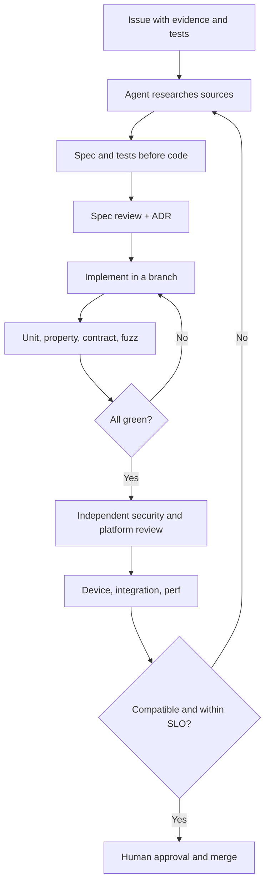

# AI agent workflow

Rivqen uses AI agents as executors and reviewers. Humans make the final decisions. This page defines roles, the task format, and the rules for agents.

**Status:** <Badge type="info" text="DESIGN" />

[[toc]]

## 1. Roles

| Agent role | Area | Required output |
|---|---|---|
| Source archaeologist | Upstream code and protocol history | Source map, SHA, evidence links, traces |
| Protocol designer | legacy formal spec, RQP capabilities, wire format | Specs, schemas, compatibility matrix |
| Rust core engineer | FSM, parser, cache, diff, stream, FFI | Code with property and fuzz tests |
| Android engineer | Kotlin API, WebView, cookies, streams | Android demo, device tests |
| iOS engineer | Swift, WKWebView experiments | P1/P2/P3 evidence, iOS demo |
| Web engineer | SSR, hydration, state, bridge | TypeScript/React packages, E2E tests |
| Backend engineer | Java, Node.js, PHP, Rust oracle | Conformance server suite |
| Security engineer | Threat model, test vectors, review | Findings, blocking risk register |
| Performance engineer | Telemetry, benchmarks | Traces, reproducible reports |
| Integrator / reviewer | Cross-cutting consistency | Gate decisions, release notes, reviews |

## 2. Task format

Every task issue has these fields (see the [task template](https://github.com/robotoss/rivqen/blob/main/.github/ISSUE_TEMPLATE/task.yml)):

```yaml
id: WP-08/T-012
goal: "One observable behavior"
source_of_truth:
  - "upstream:<path>:<line> at 59936bef, or a spec section, or an ADR"
compatibility_mode: "legacy | RQP | both"
preconditions:
  - "Agreed spec / ADR version"
inputs:
  - "Fixture / request / cache state"
expected_outputs:
  - "Actions / HTTP / state transitions / errors"
non_goals:
  - "What this task does not do"
security_invariants:
  - "No auth leak. No wrong-origin update."
tests:
  - "Unit, golden, property, fuzz, device E2E"
benchmark:
  - "Measurement or N/A"
reviewers:
  - "protocol + platform + security"
```

## 3. Process



## 4. Rules

Agents **must not**:

1. Invent a `WKWebView`, WebView or platform API that is not documented.
2. Replace evidence with "logical" behavior.
3. Count a task as passed on green unit tests when a device test is required.
4. Put secrets, tokens or private user data into prompts.
5. Make breaking changes on their own.
6. Change legacy fixtures to make new code pass.
7. Turn on an experimental transport for everyone.
8. Copy code from upstream or from incompatible-license sources (clean-room).

Agents **must**:

1. Write "NOT FOUND" when evidence does not exist.
2. Label statements as FACT, DESIGN or RESEARCH.
3. Cite `upstream:<path>:<line>` for every upstream fact.

## 5. Research agent prompt (template)

> **Task:** Describe legacy protocol as observable behavior. Go through the upstream Android, iOS, React, Java, Node.js and PHP modules, the wiki and the docs at commit `59936bef`. For each header, response code, session state and HTML marker, find the definition, where it is produced, where it is handled, and a test or demo. Build a client/server transition table for: cold, 304, data-only, template change, `cache-offline`, errors, redirects, cookies/auth. Write "NOT FOUND" when there is no evidence. Do not rewrite code and do not propose an API before the spec is complete. Output: machine-checkable fixtures, source map, risk register, questions for the architecture lead.

## 6. Human decisions

Only humans approve: API and ABI, protocol versioning, cache policy changes, iOS navigation strategy, cryptography, new OS support, security exceptions, releases.
