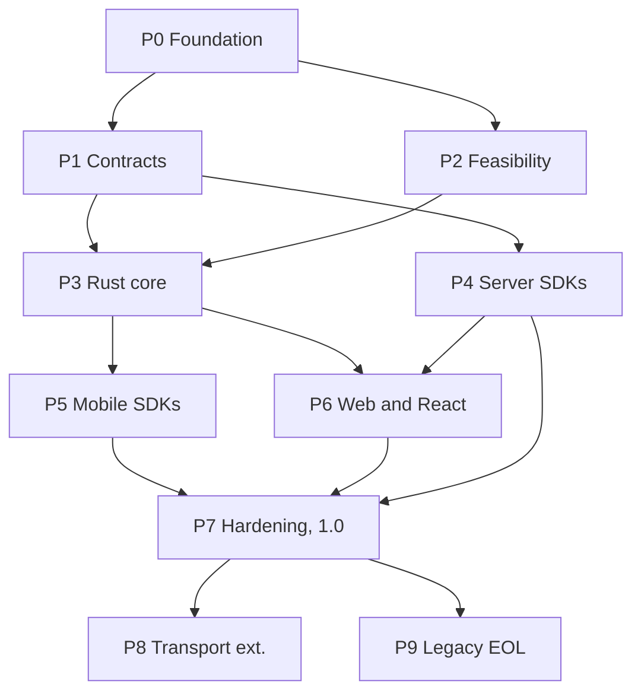

# Roadmap and phases

This page defines the phases of Rivqen development, their order, and the gate that closes each phase. Work inside a phase is split into [work packages](/engineering/plan/work-packages).

**Status:** <Badge type="info" text="DESIGN" /> This roadmap replaces the phase list of the internal starting specification (v1.3). Revision 2 (2026-10-09): the Rivqen protocol (RQP) is the default in 1.0; the legacy mode is a temporary module ([ADR-016](/engineering/architecture/adr/#adr-016)).

[[toc]]

## 1. Phases at a glance

| Phase | Name | Goal | Exit gate |
|---|---|---|---|
| **P0** | Foundation and evidence | Pinned upstream, behavioral audit, server traces, documentation, governance | **G0** |
| **P1** | Contracts | RQP specification (markup, headers, manifest, patch) + legacy contract; golden fixtures for both; Rust reference server; conformance runner | **G1** |
| **P2** | Platform feasibility | Android stream spike, iOS navigation spike, FFI cost, cookie sync | **G2** |
| **P3** | Rust core | RQP engine first; legacy as a Cargo feature | **G3** |
| **P4** | Server SDKs | Node.js → Java → PHP with RQP; separate legacy modules | **G4-S** |
| **P5** | Mobile SDKs | Android and iOS SDKs + demos | **G4-M** |
| **P6** | Web and React | web-core, React adapter, SSR, JS bridge, legacy bridge shim | **G4-W** |
| **P7** | Hardening and 1.0 | Security, performance, cache crypto, release pipeline; 1.0 = RQP default, legacy deprecated | **G5**, **G6** |
| **P8** | Transport extensions (1.x) | WebSocket push, WebTransport experiment, dictionary compression | **G7** |
| **P9** | Legacy end of life | 1.4.x last legacy release; 1.5 without legacy modules | **G8** |

## 2. Dependency graph

Arrows show "must finish before". Phases on the same level can run in parallel.

## 3. Phase details

### P0 — Foundation and evidence

| Item | Content |
|---|---|
| Work packages | WP-00, WP-01, WP-24 |
| Outputs | This documentation site; pinned upstream SHA and source manifest; behavioral audit; **server traces** of the upstream Java, Node.js and PHP implementations; risk register; ADR register |
| Milestone **M1 "init docs"** | ✅ Documentation site, two layers, plan, audit, server trace report |
| Milestone **M2 "AI foundation"** (WP-24) | ✅ Agent roles, sprint workflow, coding standards, mutation testing policy |
| Gate **G0** ✅ passed | Upstream pinned (`59936bef`); licenses inventoried; audit evidence for headers, markers, hashing, `cache-offline`, FSM, cache; divergences listed and confirmed by traces |

### P1 — Contracts

| Item | Content |
|---|---|
| Work packages | WP-02, WP-03, WP-17 (RQP specification) |
| Outputs | RQP specification with JSON Schemas; legacy normative spec; golden fixtures `fixtures/rqp` and `fixtures/legacy`; Rust reference server (both modes); conformance runner |
| Gate **G1** | Both fixture suites exist **before** any SDK code; the reference server passes them; RQP markup parsed identically by the Rust, Node.js, Java and PHP parser candidates |

### P2 — Platform feasibility

| Item | Content |
|---|---|
| Work packages | WP-04 |
| Outputs | Android stream demo; iOS P1/P2/P3 prototypes and parity matrix; FFI microbenchmarks; cookie sync tests; ADR-002, ADR-003, ADR-009, ADR-014 accepted |
| Gate **G2** | Platform limits documented as ADRs; no private API needed for the chosen design |

### P3 — Rust core

| Item | Content |
|---|---|
| Work packages | WP-05 … WP-09, WP-23 (legacy feature) |
| Outputs | Crates with unit, property and fuzz tests; RQP engine; `legacy` Cargo feature; FFI bindings smoke-tested on Android and iOS |
| Gate **G3** | All RQP fixtures pass; all legacy fixtures pass with the feature on; the core builds and passes tests **with the feature off**; invariants hold under property tests; `unsafe` reviewed |

### P4 — Server SDKs

| Item | Content |
|---|---|
| Work packages | WP-13 (Node.js), WP-14 (Java), WP-15 (PHP), WP-23 (server legacy modules) |
| Note | Starts after **G1**. It does not wait for the Rust core, because servers implement the spec and pass the same fixtures. |
| Gate **G4-S** | Each server passes the RQP suite; each legacy module passes the legacy suite; both directly and behind Nginx/Envoy/one CDN |

### P5 — Mobile SDKs

| Item | Content |
|---|---|
| Work packages | WP-10 (Android), WP-11 (iOS), WP-22 (demos) |
| Gate **G4-M** | Cold, warm, data update, template change and offline work with RQP on real devices; legacy module works against the legacy suite |

### P6 — Web and React

| Item | Content |
|---|---|
| Work packages | WP-12 |
| Gate **G4-W** | Native + React E2E passes; SSR and hydration matrix passes; legacy bridge shim passes its tests |

### P7 — Hardening and 1.0

| Item | Content |
|---|---|
| Work packages | WP-18, WP-19, WP-20, WP-21 |
| Gates | **G5** beta: `SECURITY-001`, benchmarks vs B0, signed pipeline. **G6** 1.0: `LEGAL-001`, `BRAND-001`; RQP feature-complete; legacy parity matrix covered; deprecation policy and `rivqen-migrate` published |

### P8 — Transport extensions (1.x)

| Item | Content |
|---|---|
| Work packages | WP-16 |
| Gate **G7** | No regression of RQP over HTTP; realtime gated by device capability tests; dictionary compression decided (ADR-013) |

### P9 — Legacy end of life

| Item | Content |
|---|---|
| Work packages | WP-23 |
| Steps | 1.1: security fixes only · 1.4.x: final legacy release, last warning · 1.5: legacy modules not published |
| Gate **G8** | Migration guide and tool used by the known integrators; telemetry (host-exported, opt-in) or integrator survey shows no blocking legacy use |

## 4. What changed and why

| Change | Reason |
|---|---|
| RQP is the 1.0 default (was: experimental after 1.0) | Owner decision. The audit showed that the legacy markers are ambiguous across implementations; a clean, attribute-based contract is safer and easier to test. |
| Legacy compatibility becomes optional modules with an end date (1.5) | Keeps migration possible without carrying legacy risks forever, and keeps SemVer of the core. |
| RQP specification moves to P1 | Fixtures and the reference server must exist for the default protocol before SDK work. |
| Server SDKs (P4) start after G1, not after the Rust core | Servers implement the spec and fixtures, not the Rust code (ADR-010). |
| Feasibility (P2) runs in parallel with P1 | Spikes need the audit, not the full fixture set. |
| Realtime moves to P8 (1.x) | Push channels are optional and must not delay 1.0. |

## 5. Critical path

`P0 → P1 → P3 → P5 → P7`. The most likely delay is the **iOS navigation spike** (P2), because iOS has no public interception for `https` main-frame loads. Start it first in P2.

## Related

- [Work packages](/engineering/plan/work-packages)
- [Gates and Definition of Done](/engineering/plan/gates)
- [Modes and legacy deprecation](/engineering/protocol/versioning)
