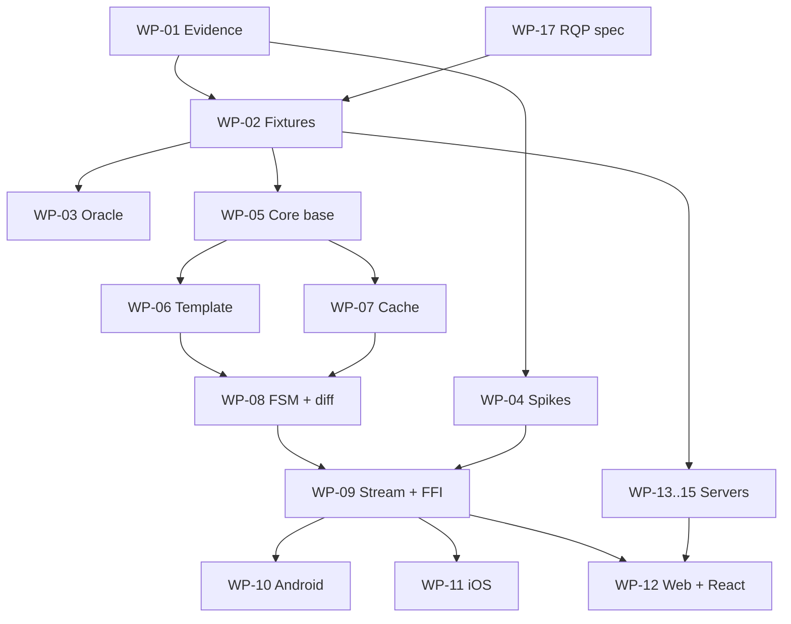

# Work packages

This is the development plan of Rivqen, split into **work packages (WP)**. A work package is a unit of work with one owner role, clear inputs, deliverables and acceptance criteria. Each WP is one stream of work. Issues are created inside a WP with the [task template](https://github.com/robotoss/rivqen/blob/main/.github/ISSUE_TEMPLATE/task.yml).

**Status:** <Badge type="info" text="DESIGN" /> Sizes are relative (S < M < L < XL), not calendar estimates.

[[toc]]

## 1. Overview

| WP | Name | Phase | Owner role | Depends on | Size | State |
|---|---|---|---|---|---|---|
| [WP-00](#wp-00) | Documentation and governance | P0 | Integrator | — | M | **Done** |
| [WP-01](#wp-01) | Upstream evidence | P0–P1 | Source archaeologist | WP-00 | L | **P0 part done**; client traces in P1 |
| [WP-02](#wp-02) | Golden fixtures and conformance runner | P1 | Protocol designer | WP-01 | L | Planned |
| [WP-03](#wp-03) | Rust reference server (oracle) | P1 | Backend engineer | WP-02 | M | Planned |
| [WP-04](#wp-04) | Platform feasibility spikes | P2 | Android + iOS engineers | WP-01 | L | Planned |
| [WP-05](#wp-05) | Core workspace, data model, errors, testkit | P3 | Rust core engineer | WP-02 | M | Planned |
| [WP-06](#wp-06) | Template engine | P3 | Rust core engineer | WP-05 | M | Planned |
| [WP-07](#wp-07) | Cache engine | P3 | Rust core engineer | WP-05 | L | Planned |
| [WP-08](#wp-08) | Session state machine and diff | P3 | Rust core engineer | WP-06, WP-07 | L | Planned |
| [WP-09](#wp-09) | Streaming and FFI | P3 | Rust core engineer | WP-04, WP-08 | L | Planned |
| [WP-10](#wp-10) | Android SDK | P5 | Android engineer | WP-09 | XL | Planned |
| [WP-11](#wp-11) | iOS SDK | P5 | iOS engineer | WP-09 | XL | Planned |
| [WP-12](#wp-12) | Web core, React adapter, JS bridge | P6 | Web engineer | WP-09, WP-13 | L | Planned |
| [WP-13](#wp-13) | Node.js server SDK | P4 | Backend engineer | WP-02 | M | Planned |
| [WP-14](#wp-14) | Java server SDK | P4 | Backend engineer | WP-02 | M | Planned |
| [WP-15](#wp-15) | PHP server SDK | P4 | Backend engineer | WP-02 | M | Planned |
| [WP-16](#wp-16) | Transport extensions (realtime, dictionary compression) | P8 | Protocol designer | WP-10, WP-11 | L | Planned |
| [WP-17](#wp-17) | Rivqen protocol (RQP) specification | P1 | Protocol designer | WP-00 | L | **Draft in docs** |
| [WP-18](#wp-18) | Security engineering | P0–P7 | Security engineer | — (continuous) | L | Planned |
| [WP-19](#wp-19) | Test infrastructure, benchmarks, observability | P1–P7 | Performance engineer | WP-02 | L | Planned |
| [WP-20](#wp-20) | CI/CD and supply chain | P1–P7 | Integrator | WP-05 | M | Planned |
| [WP-21](#wp-21) | Release, packaging, legal and brand | P7 | Release owner | WP-20 | M | Planned |
| [WP-22](#wp-22) | Demos and examples | P1–P6 | Platform engineers | WP-17 (server demo), WP-10…12 | M | **Server demo started** |
| [WP-23](#wp-23) | Legacy modules, migration tool, end of life | P3–P9 | Protocol designer | WP-02, WP-05 | M | Planned |
| [WP-24](#wp-24) | AI development foundation | P0 → P1 bridge | Architect | WP-00 | S | **Done** |

## 2. Dependency map

The diagram shows the main dependencies between work packages. Continuous WPs (WP-18, WP-19, WP-20) are not shown.

## 3. Work package details

### WP-00 — Documentation and governance {#wp-00}

| Field | Content |
|---|---|
| Goal | One source of truth for design, plan and decisions. |
| Deliverables | This site; style guide; ADR register; work-package plan; risk register; open questions; contribution and security policies. |
| Acceptance | Site builds and deploys; every page has status labels; diagrams readable at 375 px; reviewed by the architecture lead. |
| Status | **Done.** Site published from `main`; all acceptance items met. Later pages are maintained by the WP that owns the topic. |

### WP-01 — Upstream evidence {#wp-01}

| Field | Content |
|---|---|
| Goal | Describe legacy protocol as observable behavior, with evidence, before any code. |
| Inputs | Upstream at the pinned SHA; upstream wiki. |
| Tasks | 1. Write `evidence/source-manifest.lock` (SHA, file hashes, licenses). 2. Finish the behavioral audit per module (started in M1). 3. Build and run upstream server samples in an isolated lab. 4. Capture HTTP traces for the four outcomes in Quick and Standard modes on an old Android emulator. 5. List divergences between implementations. |
| Deliverables | Evidence tables in [Protocol](/engineering/protocol/) pages; captured traces; divergence list; questions for the architecture lead. |
| Acceptance | Every header, `cache-offline` value, marker rule, hash rule and result code has a source reference or is marked NOT FOUND. |
| Rules | Clean-room: no upstream code copied. |

### WP-02 — Golden fixtures and conformance runner {#wp-02}

| Field | Content |
|---|---|
| Goal | Machine-checkable truth for every implementation. |
| Deliverables | `fixtures/legacy/*` (≥ 17 fixtures, see [Golden fixtures](/engineering/protocol/fixtures)); `fixtures/malformed/*`; `server/conformance` runner (language-neutral, HTTP-level). |
| Acceptance | Each fixture records upstream SHA and source references; the runner tests a server by URL; ADR-005 accepted. |

### WP-03 — Rust reference server {#wp-03}

| Field | Content |
|---|---|
| Goal | An oracle server that passes all fixtures and serves the conformance lab. |
| Deliverables | `server/rust-reference` binary and container image. |
| Acceptance | 100 % of legacy fixtures pass; all divergence profiles selectable by configuration. |

### WP-04 — Platform feasibility spikes {#wp-04}

| Field | Content |
|---|---|
| Goal | Prove what each platform can do with public APIs. |
| Tasks | 1. Android: `shouldInterceptRequest` + bridge stream; early fetch; redirect, SSL, cookie and partial-response behavior. 2. iOS: prototypes IOS-P1, P2, P3 (+ `loadSimulatedRequest`); cookies, origin, CSP, Service Worker, history, first render. 3. FFI microbenchmark: UniFFI vs C ABI for 1 MiB in 16 KiB chunks. 4. Cookie sync tests for `HttpOnly`, `Secure`, `SameSite`. |
| Deliverables | Prototype apps; `ios-parity-matrix.md`; benchmark report; ADR-002, ADR-003, ADR-009, ADR-014. |
| Acceptance | Each capability marked supported / conditional / impossible with public APIs, with screen recordings and traces. |

### WP-05 — Core workspace, data model, errors, testkit {#wp-05}

| Field | Content |
|---|---|
| Goal | The base of the Rust core. |
| Deliverables | Cargo workspace; `rivqen-core` facade skeleton; data model types; error types; `rivqen-testkit` with fixture loader, fake clock and fake transport; CI for Rust. |
| Acceptance | `cargo test` runs fixtures as data; `#![forbid(unsafe_code)]` in all crates except `rivqen-ffi`. |

### WP-06 — Template engine {#wp-06}

| Field | Content |
|---|---|
| Goal | Exact legacy marker parsing and template/data split, bounded and fuzzed. |
| Deliverables | `rivqen-template`, `rivqen-integrity` (SHA-1 for legacy, SHA-256). |
| Acceptance | All marker fixtures pass; round-trip property holds; fuzz target clean for the agreed time; limits enforced. |

### WP-07 — Cache engine {#wp-07}

| Field | Content |
|---|---|
| Goal | Partitioned, atomic, quota-bound cache with RFC 9111 and legacy policy. |
| Deliverables | `rivqen-cache`; storage driver interface; reference file + SQLite driver; ADR-004, ADR-011. |
| Acceptance | Fault-injection tests (kill at every step) pass; multi-partition tests pass; policy matrix tests pass. |

### WP-08 — Session state machine and diff {#wp-08}

| Field | Content |
|---|---|
| Goal | The deterministic session FSM for legacy Quick and Standard behavior, plus the diff engine. |
| Deliverables | `rivqen-session`, `rivqen-proto-legacy`, `rivqen-diff`. |
| Acceptance | Every legacy fixture produces `expected.actions.json`; FSM property tests (cancel, stale generation, interleavings) pass. |

### WP-09 — Streaming and FFI {#wp-09}

| Field | Content |
|---|---|
| Goal | Bounded document streaming and the stable ABI for Kotlin and Swift. |
| Deliverables | `rivqen-stream`, `rivqen-ffi`; generated bindings; Android `.so` and iOS XCFramework builds in CI. |
| Acceptance | FFI lifecycle suite passes; Miri passes on handle code; smoke test runs on an Android emulator and an iOS simulator. |

### WP-10 — Android SDK {#wp-10}

| Field | Content |
|---|---|
| Goal | Kotlin SDK with WebView integration. |
| Deliverables | `sdk/android`: engine, session factory, WebView controller, request interceptor, bridge (WebMessageListener), cache directory, metrics; consumer R8 rules. |
| Acceptance | Requirements `A-01`…`A-10` pass; Android E2E suite passes on the device matrix. |

### WP-11 — iOS SDK {#wp-11}

| Field | Content |
|---|---|
| Goal | Swift SDK with WKWebView integration using the strategy chosen in ADR-003. |
| Deliverables | `sdk/ios`: engine actor, session, WebView controller, message handlers, Keychain integration, privacy manifest. |
| Acceptance | iOS requirements pass; iOS E2E suite passes; limits documented in the support matrix. |

### WP-12 — Web core, React adapter, JS bridge {#wp-12}

| Field | Content |
|---|---|
| Goal | Safe in-page updates and React integration. |
| Deliverables | `@rivqen/web-core`, `@rivqen/react`, `@rivqen/ssr`, `@rivqen/next`; bridge schema; SSR demo. |
| Acceptance | React SSR suite passes; bridge security tests pass; works under a strict CSP. |

### WP-13 / WP-14 / WP-15 — Server SDKs {#wp-13}

| Field | Content |
|---|---|
| Goal | Native-language server middleware for Node.js, Java and PHP. |
| Order | Node.js first (closest to the React demo), then Java, then PHP. |
| Deliverables | Packages with framework adapters (see [Server SDKs](/engineering/server/)); docs; examples. |
| Acceptance | Full conformance suite passes, directly and through the proxy lab. |

### WP-16 — Transport and realtime {#wp-16}

| Field | Content |
|---|---|
| Goal | HTTP/3 measurements, WebSocket push, WebTransport experiment, dictionary compression (ADR-013). |
| Deliverables | Realtime channel protocol; client and server support; chaos suite; ADR-007. |
| Acceptance | No functional loss when channels fail; device capability matrix published. |

### WP-17 — Rivqen protocol {#wp-17}

| Field | Content |
|---|---|
| Goal | The default, versioned, typed protocol of Rivqen: `data-rq-block` markup, manifest, `Rq-*` headers, patches. |
| Deliverables | RQP specification ([markup](/engineering/protocol/markup), [negotiation](/engineering/protocol/negotiation), [manifest and patch](/engineering/protocol/manifest-patch)); JSON Schemas; fixtures `fixtures/rqp`; `rivqen-proto` crate (in P3); ADR-006 accepted. |
| Acceptance | Specification reviewed; fixtures exist before SDK code; parsers in Rust, Node.js, Java and PHP agree on all markup fixtures. |

### WP-18 — Security engineering {#wp-18}

| Field | Content |
|---|---|
| Goal | The controls in [Security controls](/engineering/security/controls) are implemented and proven. |
| Deliverables | Threat model updates per phase; security test suites; crypto ADR; release audit; pentest report. |
| Acceptance | Gate `SECURITY-001`. |

### WP-19 — Test infrastructure, benchmarks, observability {#wp-19}

| Field | Content |
|---|---|
| Goal | Reproducible measurement of correctness and performance. |
| Deliverables | Network lab; device farm setup; benchmark harness; B0/B1 baselines; metric schema. |
| Acceptance | Benchmark reports with method, raw data and confidence intervals. |

### WP-20 — CI/CD and supply chain {#wp-20}

| Field | Content |
|---|---|
| Goal | Every change is built, tested, scanned and traceable. |
| Deliverables | Workflows per ecosystem; `deny.toml`; SBOM; provenance; DCO check; REUSE compliance. |
| Acceptance | All checks in [CI/CD](/engineering/delivery/ci-cd) active and required. |

### WP-21 — Release, packaging, legal and brand {#wp-21}

| Field | Content |
|---|---|
| Goal | Signed, documented, legally clean releases. |
| Deliverables | Release workflows per registry; trademark clearance record; final package names; `LEGAL-001` checklist. |
| Acceptance | Gates G5 and G6. |

### WP-22 — Demos and examples {#wp-22}

| Field | Content |
|---|---|
| Goal | Show every outcome on every platform. |
| Deliverables | Android and iOS demos with five screens (Cold, Warm, Live diff, Template changed, Offline) and controls (disable Rivqen, slow network, clear cache, logout); React SSR demo; server demo. |
| Acceptance | Demos show real metrics and revisions, never tokens. |
| Status | `examples/server-demo` (Node.js, RQP reference behavior) exists; see [Examples](/guide/examples/). |

### WP-23 — Legacy modules, migration tool, end of life {#wp-23}

| Field | Content |
|---|---|
| Goal | Temporary compatibility with the VasSonic legacy protocol, and a clean exit from it. |
| Deliverables | `legacy` Cargo feature + `rivqen-proto-legacy`; Android, iOS, web and server legacy modules; `rivqen-migrate` tool (converts `sonicdiff` comment markers to `data-rq-block`); deprecation warnings; end-of-life releases (1.4.x final, 1.5 removal). |
| Acceptance | Legacy fixtures pass in every legacy module; the core builds and passes all tests without the legacy feature; migration tool round-trips all legacy fixtures. |
| Policy | [Modes and legacy deprecation](/engineering/protocol/versioning) |

### WP-24 — AI development foundation {#wp-24}

| Field | Content |
|---|---|
| Goal | A repeatable way for an AI architect and AI executors to build Rivqen: roles, sprints, parallel work without conflicts, decisions, tests, docs. |
| Deliverables | `AGENTS.md`, `CLAUDE.md`; `.claude/agents/` (junior, middle, senior, researcher, docs steward, security reviewer); `.claude/skills/` (wp-start, sprint-plan, dispatch, decide, doc-sync, mutation-check, sprint-close); `.claude/rules/`; `.claude/settings.json`; [AI development](/engineering/ai/); [Coding standards](/engineering/standards/); [Mutation testing](/engineering/quality/mutation); sprint record template; decision log. |
| Acceptance | Every WP from P1 on can start with `/wp-start` and close with `/sprint-close`; rules exist for each language in the plan; docs build. |
| Status | **Done.** |

## 4. Rules for every work package

1. Spec and tests come **before** code.
2. Each task has a brief: goal, source of truth, owned paths, contracts, acceptance, tests, checks, docs, non-goals, security ([Sprint workflow](/engineering/ai/sprint#_3-task-brief)).
3. A WP is done only when its acceptance criteria are met **with evidence** (test results, reports, recordings).
4. A WP that finds a platform limit writes an ADR with `PARITY-CONDITIONAL` or `PLATFORM-UNSUPPORTED`. It is never closed silently.

## Related

- [Roadmap and phases](/engineering/plan/roadmap)
- [Gates and Definition of Done](/engineering/plan/gates)
- [AI development](/engineering/ai/)
