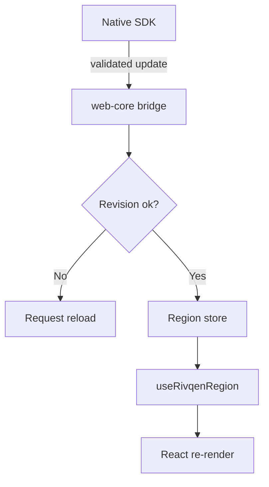

# Web and React SDK

The web SDK runs inside the page. It receives validated data updates from the native SDK and applies them safely. The React adapter connects updates to React state.

**Status:** <Badge type="info" text="DESIGN" /> Work package WP-12.

[[toc]]

## 1. Upstream for comparison

<Badge type="tip" text="FACT" /> The upstream `sonic-react` is a demo, not a library: Next.js (`"next": "latest"`, unpinned), React 16, Redux 3, Koa 2, `cheerio`, and the npm package `sonic_differ` (`upstream:sonic-react/package.json`). The server converts elements with a `data-sonicdiff="name"` attribute into `<!--sonicdiff-name-->` comment markers and wraps the Next.js initial state in a block named `initState` (`sonic-react/server.js:30-55`). The page calls `window.sonic.getDiffData()` and handles `getDiffDataCallback` with codes 1000, 2000, 200 and 304 (`sonic-react/pages/demo.js:54-100`).

## 2. Packages

| Package | Content | Depends on |
|---|---|---|
| `@rivqen/web-core` | Message schema, validators, revision checks, capability detection, region registry | none |
| `@rivqen/react` | `RivqenProvider`, `useRivqenSession`, `useRivqenRegion`, `useRivqenRevision`, `useRivqenConnection`, `<RivqenRegion>` | `web-core`, React ≥ 18 |
| `@rivqen/ssr` | Server helpers: region markup, manifest, legacy markers | `web-core` |
| `@rivqen/next` | Next.js adapter (App Router and Pages Router tested separately) | `ssr`, `react` |
| `@rivqen/bridge-compat` | Optional shim with upstream names (`window.sonic.getDiffData`, `getDiffDataCallback`) on top of the secure bridge | `web-core` |

Current baselines (Oct 2026): React 19.3, Next.js 16.4, TypeScript 7.0 <Badge type="tip" text="FACT" /> (npm registry). Support ranges are set in WP-12.

## 3. Rules

| ID | Rule |
|---|---|
| W-01 | No `eval`, `new Function`, or method dispatch from strings. |
| W-02 | Validate every message against the schema at runtime (`zod` or `valibot`, chosen by bundle size). |
| W-03 | Apply updates only to SDK-owned regions or through React state. Never patch DOM that React owns. |
| W-04 | Check `base_revision` and `template_revision` before any update. On mismatch, ask native for a full reload. |
| W-05 | Work under strict CSP with nonces and Trusted Types. Never require `unsafe-inline` or `unsafe-eval`. |
| W-06 | One owner per state: React store, declarative data model, or isolated region. |
| W-07 | The SDK does not depend on WebTransport or WebSocket in a normal browser. |

## 4. React integration

| Topic | Design |
|---|---|
| Preferred data format | `json` blocks (RQP) rendered by components. HTML blocks only in `<RivqenRegion>` that React does not hydrate. |
| Hydration | SSR emits `template_revision` and `initial_state_revision`. A mismatch on the client triggers a full snapshot, not a DOM repair. |
| Streaming SSR | Supported only where tests confirm it. The server buffers each block until its end marker before hashing. |
| legacy pages | `bridge-compat` delivers the upstream JSON format to legacy pages. |

## 5. SSR markup

| Mode | Markup |
|---|---|
| legacy | `<!--sonicdiff-name-->…<!--sonicdiff-name-end-->` emitted by `@rivqen/ssr`, never written by hand |
| RQP | `
…
` + manifest script with hashes |

## Related

- [JS bridge contract](/engineering/platforms/js-bridge)
- [RQP manifest and patch](/engineering/protocol/manifest-patch)
- [Getting started: Web and React](/guide/getting-started/web-react)
