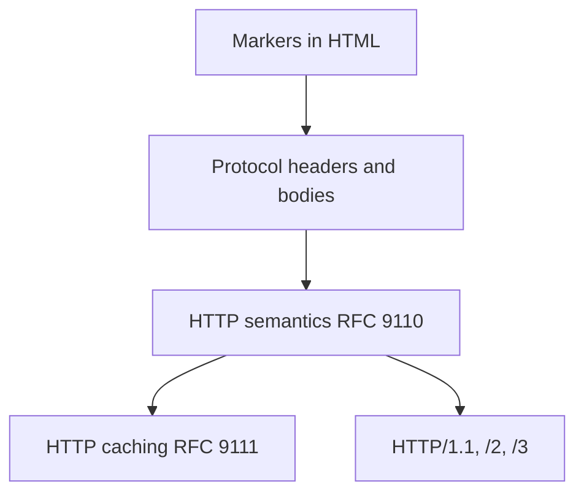

# Protocol overview

This section is the **normative specification** of the wire protocols that Rivqen clients and servers speak. It uses the RFC 2119 keywords MUST, SHOULD and MAY.

**Status:** RQP pages: <Badge type="info" text="DESIGN" />. Legacy pages: <Badge type="tip" text="FACT" /> from the upstream audit, confirmed by [server traces](/engineering/protocol/legacy-traces). The legacy mode is **temporary** (deprecated from 1.0, removed in 1.5).

## 1. Pages

| Page | Content | Normative? |
|---|---|---|
| [RQP markup](/engineering/protocol/markup) | `data-rq-block` grammar, template, title | Draft |
| [RQP negotiation and headers](/engineering/protocol/negotiation) | Versions, capabilities, `Rq-*` headers | Draft |
| [RQP manifest and patch](/engineering/protocol/manifest-patch) | JSON schemas and validation | Draft |
| [Modes and legacy deprecation](/engineering/protocol/versioning) | Mode selection, downgrade rules, end of life of the legacy mode | Yes |
| [Golden fixtures](/engineering/protocol/fixtures) | Fixture format and catalog | Yes |
| [Legacy: wire contract](/engineering/protocol/legacy-wire) | Headers, status codes, bodies, `cache-offline` | Yes (legacy module) |
| [Legacy: markers grammar](/engineering/protocol/legacy-markers) | `sonicdiff` markers, template/data split, hashing | Yes (legacy module) |
| [Legacy: client behavior](/engineering/protocol/legacy-client) | Quick and Standard modes, session id, result codes | Yes (legacy module) |
| [Legacy: divergences](/engineering/protocol/legacy-divergences) | Differences between upstream implementations; parity matrix | Yes (legacy module) |
| [Legacy: server trace report](/engineering/protocol/legacy-traces) | Captured behavior of the upstream servers | Evidence |

## 2. Layers

A Rivqen protocol message is always a valid HTTP message. Rivqen never changes HTTP semantics. It adds headers, a body format and markers.

## 3. Sources of truth

1. **Legacy protocol:** upstream code at `59936bef` + golden fixtures. When implementations differ, [ADR-005](/engineering/architecture/adr/#adr-005) defines the canonical profile.
2. **Rivqen protocol:** this specification + interoperability tests. Changes need an ADR and a protocol version rule.
