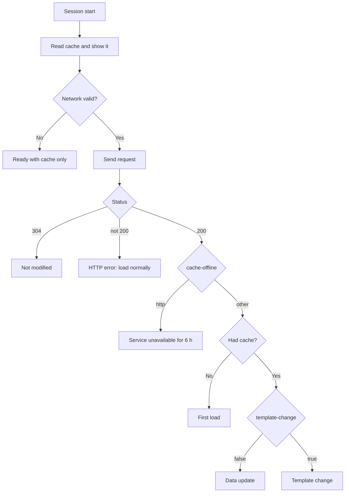

# Legacy protocol: client behavior

::: warning Legacy mode — temporary
This page describes the **legacy mode** (compatibility with the VasSonic legacy protocol). It ships as an optional module, is **deprecated from 1.0** and is **removed in 1.5**. New integrations use the [Rivqen protocol](/engineering/protocol/markup). See [Modes and legacy deprecation](/engineering/protocol/versioning).
:::

This page specifies the observable behavior of a legacy protocol client: session identity, the session flow, Quick and Standard modes, result codes, and how the page receives data updates.

**Status:** <Badge type="tip" text="FACT" /> from the upstream Android and iOS clients at `59936bef`. <Badge type="warning" text="RESEARCH" /> Timing-dependent behavior must be confirmed with captured traces (WP-01).

Paths below are relative to `upstream:sonic-android/sdk/src/main/java/com/tencent/sonic/sdk/` unless they start with `sonic-iOS/`.

[[toc]]

## 1. Session identity

Upstream derives a **session id** from the URL. The id names the cache files.

| Step | Android (`SonicRuntime.java:75-113`) | iOS (`sonic-iOS/Sonic/Util/SonicUtil.m:31-106`) |
|---|---|---|
| Base | `authority` (host + port) + `path` | `scheme://host` + `path` |
| Query parameters kept | Names that start with `sonic_`, plus names listed in `sonic_remain_params` (`;`-separated) | Same rule |
| Order of kept parameters | Sorted by name (`TreeSet`) | Dictionary order (not defined) |
| Kept parameter format | `name` + `value`, no separator | `name=value&`, after a `/` |
| Other query parameters | **Ignored** | **Ignored** |
| Hash | MD5, lowercase hex | MD5, lowercase hex |
| Account | If `IS_ACCOUNT_RELATED` (default `true`, `SonicSessionConfig.java:56`): `<account>_` + MD5 | If an account is set: MD5 of `<account>_<url>` |

::: danger Consequences that Rivqen must not copy silently
1. Two URLs that differ only in a normal query parameter (for example `?id=1` and `?id=2`) share one session id and one cache entry, unless the page lists the parameter in `sonic_remain_params`.
2. On Android, `http` and `https` versions of a URL share one id (the scheme is not part of it).
3. On Android, the account string appears in clear text in cache file names.
:::

**Rivqen rule:** the legacy session id is computed exactly as upstream **only** to build compatible request state (validators). The Rivqen [cache key](/engineering/cache/identity) is separate and always includes the partition and the full canonical URL. <Badge type="info" text="DESIGN" />

## 2. Session flow

The flow below is common to both modes (`SonicSession.java:531-800`).

Additional rules from the code:

| Rule | Evidence |
|---|---|
| If `cache-offline` is absent or `false` on a non-first load, the cache is removed and no update is delivered | `SonicSession.java:754-757` |
| If `etag` or `template-change` is missing on a non-first load, the cache is removed | `SonicSession.java:765-768` |
| `template-change` values `false` and `0` mean data update | `SonicSession.java:772-776` |
| A `sonic-link` header starts subresource preload | `SonicSession.java:705-709` |
| With `SUPPORT_CACHE_CONTROL` on and a fresh cache, no request is sent | `SonicSession.java:663-673` |
| Default timeouts: connect 5 s, read 15 s | `SonicSessionConfig.java:30-35` |

## 3. Quick and Standard modes

The upstream default is **Quick** (`SonicSessionConfig.java:88`).

| | Quick (`QuickSonicSession`) | Standard (`StandardSonicSession`) |
|---|---|---|
| How the page is loaded | Mostly `loadDataWithBaseURL` with the cached or rebuilt HTML; `loadUrl` in some cases | **Only** `loadUrl`; the document is returned by request interception |
| Cached page display | Loaded directly as data before the network answers | Returned as the intercepted response stream |
| Response headers for the WebView (CSP etc.) | **Not available** when loading data — upstream warns that this "may cause a security risk" | Available, because the intercepted response carries headers |
| Data update delivery | Diff to the page via JS callback, or reload with rebuilt HTML if the page has not loaded yet | Same JS callback; otherwise the rebuilt HTML is the intercepted stream |
| Evidence | `QuickSonicSession.java:30-48` (class comment), `:232-380` | `StandardSonicSession.java:31-40` (class comment), `:119-250` |

::: warning Security note
Upstream itself documents that Quick mode loses response headers such as `Content-Security-Policy` when it loads HTML as data (`QuickSonicSession.java:39-43`). Rivqen does not load sensitive pages without their security headers. <Badge type="info" text="DESIGN" />
:::

### Quick mode outcomes

| Situation | WebView action | Result codes (src → final) | Evidence |
|---|---|---|---|
| No cache, WebView asks first | Intercept stream (bridge stream) | 1000 → 1000 | `QuickSonicSession.java:277-284` |
| No cache, full data arrived before WebView started | `loadDataWithBaseURL` with the full HTML | 1000 → 304 | `:286-292` |
| Cache shown, server 304 | Nothing | 304 → 304 | `SonicSession.java:828-843` |
| Cache shown, data update, page already loaded | Diff delivered to JS | 200 → 200 | `QuickSonicSession.java:318` |
| Data update before page load | Rebuilt HTML loaded as data | 200 → 304 | `:321-329` |
| Template change, page loaded | Reload (data or URL) | 2000 → 2000 | `:352-362` |
| Template change before page load | New HTML loaded as data | 2000 → 304 | `:365-373` |
| Connection error / service unavailable | `loadUrl` (normal load) | — | `:202-228` |

## 4. Result codes

| Code | Meaning | Android constant | iOS constant |
|---|---|---|---|
| `-1` | Unknown | `SONIC_RESULT_CODE_UNKNOWN` | — |
| `1000` | First load | `SONIC_RESULT_CODE_FIRST_LOAD` | `SonicStatusCodeFirstLoad` |
| `2000` | Template change | `SONIC_RESULT_CODE_TEMPLATE_CHANGE` | `SonicStatusCodeTemplateUpdate` |
| `200` | Data update | `SONIC_RESULT_CODE_DATA_UPDATE` | `SonicStatusCodeDataUpdate` |
| `304` | Cache hit, nothing to do | `SONIC_RESULT_CODE_HIT_CACHE` | `SonicStatusCodeAllCached` |

Evidence: `SonicSession.java:166-186`; `sonic-iOS/Sonic/SonicConstants.h:28-48`.

Each session reports a **source** code (what the server answered) and a **final** code (what the page should do). Example: data update before the page loaded → src `200`, final `304` (the page already shows the new data).

## 5. Delivering data to the page

### 5.1 Bridge

<Badge type="tip" text="FACT" /> The upstream Android sample exposes a Java object named `sonic` with `addJavascriptInterface` (`upstream:sonic-android/sample/src/main/java/com/tencent/sonic/demo/BrowserActivity.java:172`). The page calls `window.sonic.getDiffData()`; the native side answers by calling the global JS function `getDiffDataCallback(json)` through a `javascript:` URL (`…/SonicJavaScriptInterface.java:45-71`). A second method, `getDiffData2(callbackName)`, takes the callback name from the page and puts it into the `javascript:` URL.

::: danger Not copied into Rivqen
`addJavascriptInterface` exposes methods to every frame of the page, and building a `javascript:` URL from a page-supplied name is an injection risk. Rivqen provides the same **message** to legacy pages through the secure [JS bridge](/engineering/platforms/js-bridge) and an optional compatibility shim with the same JavaScript names. <Badge type="info" text="DESIGN" />
:::

### 5.2 Message format

| Key | Android | iOS | Meaning |
|---|---|---|---|
| `code` | integer | string | Final result code |
| `srcCode` | integer | string | Source result code |
| `result` | string with JSON of changed blocks | pretty-printed JSON string | Present only for data updates |
| `local_refresh_time` | milliseconds since the diff was computed | string | Freshness of the diff |
| `extra` | `{ <etag-key>, "template-tag", "cache-offline", "isReload" }` | `{ "eTag", "template-tag", "cache-offline", "isReload": "true"/"false" }` | Diagnostics |

Evidence: `SonicSession.java:1086-1170`; `sonic-iOS/Sonic/Session/SonicSession.m:652-695`.

Rules from the code:

1. Android drops a pending diff that is older than **30 seconds** (`SonicSession.java:1112-1124`).
2. Android computes the diff as: every server key whose value differs from the local value (new keys included) (`SonicUtils.java:271-299`). iOS includes only keys that **already exist** locally (`sonic-iOS/Sonic/Util/SonicUtil.m:210-227`).
3. With `cache-offline: store`, iOS reports code `304` and no diff (`SonicSession.m:662-668`).

## 6. Local server mode (VasSonic 2.0)

If the server does not speak the legacy protocol and `SUPPORT_LOCAL_SERVER` is on (default **off**, `SonicSessionConfig.java:78`), the client computes `etag` and `template-tag` itself from the full response and simulates the server decision (`SonicServer.java:129-187`; `upstream:assets/Sonic2.0.md`).

Consequences: the client must download the **full** HTML every time. Only the WebView rendering is saved, not the bytes.

## 7. Subresource preload (VasSonic 3.0)

| Item | Upstream behavior | Evidence |
|---|---|---|
| Declaration | Response header `sonic-link: url1;url2;…` or a client-side custom header | `upstream:assets/VasSonic3.0_preload.md` §1.1 |
| Lifetime | `max-age` query parameter on each resource URL | same, §1.3 |
| Storage | `/sdcard/SonicResource/` (external storage), MD5 of URL as file name | same, §1.3 |
| Verification | SHA-1 of file content (default) or size | `SonicConfig.java:61` |
| Limit | 60 MB, checked every 24 h | `SonicConfig.java:40-45` |

::: warning
External storage is readable by other apps on old Android versions. Rivqen stores all resources in app-private storage. <Badge type="info" text="DESIGN" />
:::

## 8. Cache defaults (Android)

| Setting | Value | Evidence |
|---|---|---|
| Session cache max size | 30 MB | `SonicConfig.java:35` |
| Resource cache max size | 60 MB | `SonicConfig.java:40` |
| Cache check interval | 24 h | `SonicConfig.java:45` |
| Max cache age with `Cache-Control` | 5 min | `SonicConfig.java:55` |
| Verify cache files with SHA-1 | on | `SonicConfig.java:61` |
| Files per session | `<id>.html`, `<id>.tpl`, `<id>.data`, `<id>.header` | `SonicFileUtils.java:45-60` |
| Metadata | SQLite table with session id, etag, template tag, html SHA-1, unavailable time, size, update time, expiry, hit count | `SonicDataHelper.java:89-100` |

## Related

- [Legacy protocol wire contract](/engineering/protocol/legacy-wire)
- [Session state machine](/engineering/core/session-fsm)
- [Divergences](/engineering/protocol/legacy-divergences)
