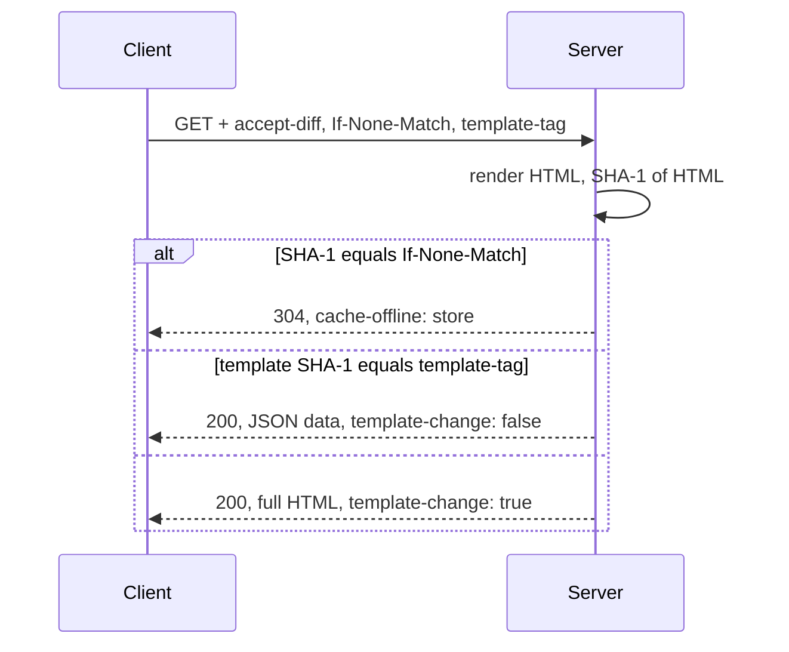

# Legacy protocol: wire contract

::: warning Legacy mode — temporary
This page describes the **legacy mode** (compatibility with the VasSonic legacy protocol). It ships as an optional module, is **deprecated from 1.0** and is **removed in 1.5**. New integrations use the [Rivqen protocol](/engineering/protocol/markup). See [Modes and legacy deprecation](/engineering/protocol/versioning).
:::

This page specifies the legacy protocol as observed in the upstream implementations. Rivqen clients and servers MUST follow it in legacy protocol mode. Where upstream implementations disagree, this page states the **canonical** behavior and links to [Divergences](/engineering/protocol/legacy-divergences).

**Status:** <Badge type="tip" text="FACT" /> derived from upstream code at `59936bef` and **confirmed for the three servers by captured HTTP traces** (2026-10-09, 115 checks; see [server trace report](/engineering/protocol/legacy-traces)). Client-side items still need Android traces (WP-01).

Evidence prefix: `upstream:` = `Tencent/VasSonic@59936beff656d4b5718ff6444d6c5e001a2c5231`.

[[toc]]

## 1. Overview



## 2. Request headers (client → server)

| Header | Value | When sent | Evidence |
|---|---|---|---|
| `accept-diff` | `true` or `false` | Always. `true` when the session accepts data updates (default). | `upstream:sonic-android/sdk/src/main/java/com/tencent/sonic/sdk/SonicSessionConnection.java:347` |
| `If-None-Match` | Cached `etag` value (lowercase hex SHA-1, **unquoted**) | When the client has a cache entry | `…/SonicSessionConnection.java:350-352` |
| `template-tag` | Cached template SHA-1 (lowercase hex) | When the client has a cache entry | `…/SonicSessionConnection.java:354-356` |
| `sonic-sdk-version` | `Sonic/<version>` (for example `Sonic/2.0.0`) | Always (Android, iOS) | `…/SonicSessionConnection.java:361`; `upstream:sonic-iOS/Sonic/SonicConstants.h:127-132` |
| `Cookie` | From the WebView cookie store | When cookies exist | `…/SonicSessionConnection.java:370-372` |
| `User-Agent` | The WebView user agent | Always | `…/SonicSessionConnection.java:377` |
| `Accept-Encoding` | `gzip` | Always (Android) | `…/SonicSessionConnection.java:359` |
| `Host` + `sonic-dns-prefetch` | Original host | Only for IP-direct connections (optional feature) | `…/SonicSessionConnection.java:301-305` |

::: info Rivqen deviation (privacy)
`sonic-sdk-version` identifies the SDK on the network. In Rivqen, this header is **off by default** (`identity.sdkHeader = false`) because no upstream server reads it. The compatibility profile `legacy-strict-headers` sends it. <Badge type="info" text="DESIGN" />
:::

## 3. Server detection of a legacy request

| Implementation | Rule | Evidence |
|---|---|---|
| Java | `accept-diff == "true"` enables only the `304` check and the `Cache-Control`/`Cache-Offline` headers. The **data-only response is chosen by the `template-tag` request header alone**, even with `accept-diff: false` (trace S08). | `upstream:sonic-java/src/main/java/com/github/tencent/SonicFilter.java:69-77, 105-144` |
| PHP | Header `accept-diff` is identical to `"true"`. The header **name** lookup is case-sensitive: `Accept-Diff: true` is not detected on the PHP built-in server (trace S10). | `upstream:sonic-php/sdk/sonic.php:59` |
| Node.js | Header `accept-diff` is present and non-empty (any value, also `false`) **and** the client accepts `gzip` or `deflate`; with `Accept-Encoding: identity` the middleware skips legacy processing (traces S08, S09, S11). | `upstream:sonic-nodejs/middleware/compress.js:26-28, 78` |

**Canonical (MUST):** a server treats a request as a legacy request only when `accept-diff` equals `true` (case-insensitive header name, exact lowercase value).

## 4. Hashes

| Value | Algorithm | Input | Encoding | Evidence |
|---|---|---|---|---|
| `etag` (a.k.a. `html-sha1`) | SHA-1 | The full HTML response body **as rendered by the origin**, UTF-8 bytes, before compression | Lowercase hex, 40 characters, no quotes | Java `SonicFilter.java:92-93` + `SonicUtil.java:21-54`; Node `common/diff.js:15`; PHP `sdk/sonic.php:73` |
| `template-tag` | SHA-1 | The template string (section 5 of [markers grammar](/engineering/protocol/legacy-markers)), UTF-8 bytes | Lowercase hex | Java `SonicFilter.java:119`; Node `common/diff.js:66`; PHP `sdk/sonic.php:109` |

::: warning SHA-1 is not a security mechanism
SHA-1 is used only as a version identifier. Rivqen never uses these values for authentication or integrity against attackers. See [Cryptography](/engineering/security/crypto).
:::

## 5. Response cases

### 5.1 Not modified

Condition: the request is a legacy request, `If-None-Match` is present, and it equals the SHA-1 of the rendered HTML.

| Field | Value |
|---|---|
| Status | `304 Not Modified` |
| `Cache-Offline` | `store` |
| `Content-Length` | `0` |
| Body | none |

Evidence: Java `SonicFilter.java:96-101`; Node `common/diff.js:26-33`; PHP `sdk/sonic.php:75-80`. Comparison is case-insensitive in Java and case-sensitive in Node.js and PHP (traces S04). A quoted value (`"<sha1>"`) is never recognized (trace S05).

<Badge type="tip" text="FACT" /> **Trace finding:** the Java filter sends **two** `Cache-Offline` header fields on `304` — `true` (added for every legacy request) and `store` (trace S03). A client that joins repeated fields sees `true, store`.

### 5.2 Data update (template unchanged)

Condition: not 304, and the SHA-1 of the computed template equals the request `template-tag`.

| Field | Value |
|---|---|
| Status | `200` |
| `etag` (header name may be overridden, section 6) | SHA-1 of the full HTML |
| `template-tag` | SHA-1 of the template |
| `template-change` | `false` |
| `Cache-Offline` | `true` |
| Body | JSON object (section 5.4) |
| `Content-Type` | Unchanged from the origin (typically `text/html`) — the body is JSON nevertheless |

### 5.3 Template change or first load

Condition: not 304, and the template SHA-1 differs from the request `template-tag` (or the client sent none).

| Field | Value |
|---|---|
| Status | `200` |
| `etag`, `template-tag` | As in 5.2 |
| `template-change` | `true` |
| `Cache-Offline` | `true` |
| Body | The full HTML |

### 5.4 Data body format

```json
{
  "data": {
    "{title}": "<title>Shop</title>",
    "{price}": "<!--sonicdiff-price--><p class=\"price\">120.00</p><!--sonicdiff-price-end-->"
  },
  "template-tag": "<40 hex>",
  "html-sha1": "<40 hex>",
  "diff": ""
}
```

| Key | Meaning |
|---|---|
| `data` | Map of placeholder → content. Keys include the braces. Values include the **marker comments** themselves. `{title}` is always present (empty string if no title). |
| `template-tag` | Same as the header |
| `html-sha1` | SHA-1 of the full HTML; the client uses it to verify the rebuilt page |
| `diff` | Always the empty string in upstream servers |

The server sends **all** data blocks, not only changed ones. The client computes the difference.

## 6. Custom etag header name

A server MAY rename the `etag` header. It then sends `sonic-etag-key: <name>` and puts the value in `<name>`. The Android client reads `sonic-etag-key` and falls back to `eTag` (`SonicSessionConnection.java:519-521`).

<Badge type="tip" text="FACT" /> **Trace finding:** the Node.js demo does **not** use `common/diff.js`. Its middleware loads the published npm package `sonic_differ` (latest 1.0.7, MIT), and that package always writes `Etag` and never sends `sonic-etag-key` (trace S02; package source compared with `common/diff.js`). The repository file `common/diff.js` is a newer, unused variant.

## 7. `cache-offline` {#cache-offline}

`cache-offline` tells the client how to use and store the response.

| Value | Client behavior | Evidence |
|---|---|---|
| `true` | Store the new data **and** refresh the page | `upstream:sonic-android/…/SonicSession.java:146-152`; `SonicUtils.java:575-603` |
| `false` | Refresh the page, do **not** store; remove the existing cache | `SonicSession.java:155-161`; flow `SonicSession.java:754-757` |
| `store` | Store the new data, do **not** refresh the current page | `SonicSession.java:136-144` |
| `http` | Legacy mode is unavailable for this URL: load normally and do not use legacy mode for a period | `SonicSession.java:125-133`; flow `SonicSession.java:730-745` |
| absent | Treated like `false` on non-first loads (cache removed) | `SonicSession.java:754-757` |

The `http` period is **6 hours** by default: Android `SONIC_UNAVAILABLE_TIME = 6 * 60 * 60 * 1000` ms (`upstream:sonic-android/…/SonicConfig.java:30`), iOS `cacheOfflineDisableTime = 21600` s (`upstream:sonic-iOS/Sonic/Engine/SonicConfiguration.m:31`).

Rivqen rules:

1. In legacy mode, Rivqen implements all four values.
2. `Cache-Control: no-store` **overrides** `cache-offline: true` and `store`. (Upstream Android checks `Cache-Control` only when `SUPPORT_CACHE_CONTROL` is on, default off: `SonicSessionConfig.java:72`, `SonicUtils.java:575-596`.)
3. The `http` period is configurable; default 6 hours for compatibility.

## 8. Other response headers

| Header | Use | Evidence |
|---|---|---|
| `sonic-link` | `;`-separated list of subresource URLs to prefetch (VasSonic 3.0). A `max-age` query parameter on each URL sets its cache lifetime. | `upstream:assets/VasSonic3.0_preload.md`; `SonicSession.java:705-708` |
| `Set-Cookie` | Copied into the WebView cookie store by the client | `SonicSession.java:1250` |
| `Content-Security-Policy`, `Content-Security-Policy-Report-Only` | Read by the client and passed to the WebView where the API allows | `SonicSessionConnection.java:110-119` |
| `Cache-Control`, `Expires`, `Pragma` | Used for cache lifetime only when `SUPPORT_CACHE_CONTROL` is on; lifetime capped at 5 minutes (`SONIC_CACHE_MAX_AGE`) | `SonicUtils.java:154-205`; `SonicConfig.java:55` |
| `Cache-Control: no-cache` | Added by Java and PHP servers to legacy responses | `SonicFilter.java:71`; `sonic.php:60` |

## 9. Non-legacy clients

**Canonical (MUST):** a server does not change the response body or add legacy headers for requests that are not legacy requests.

Upstream Java violates this: it adds `Etag`, `template-tag` and `template-change` to every text response (`SonicFilter.java:103-144`). PHP and Node.js do not. See [Divergences](/engineering/protocol/legacy-divergences).

## 10. Verification

Fixtures `FX-LEG-*` in [Golden fixtures](/engineering/protocol/fixtures) cover every section of this page.
