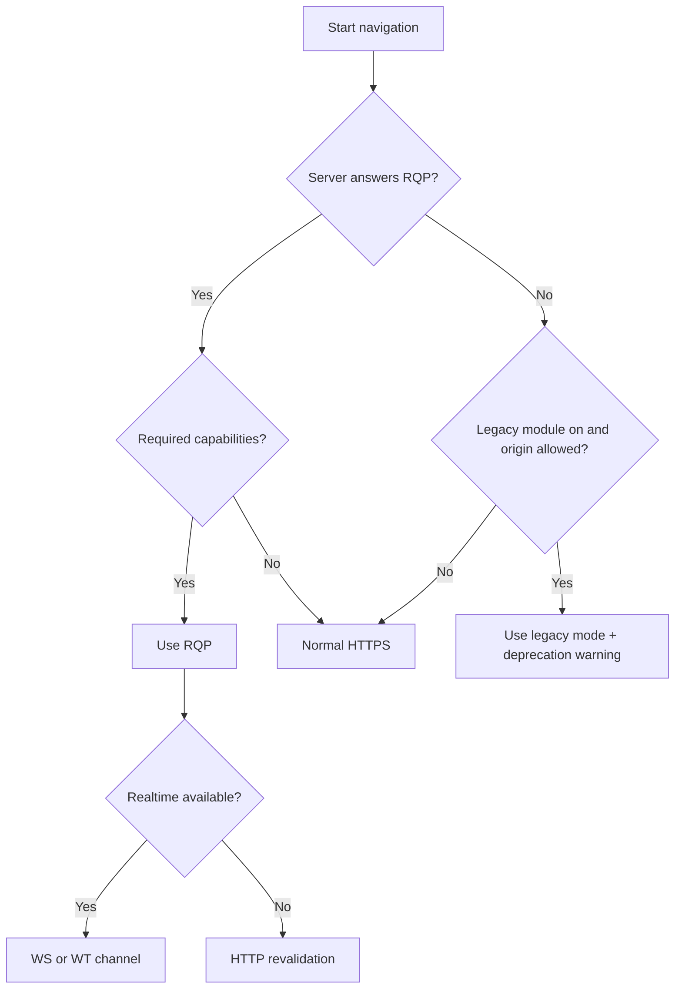

# Versioning, modes and legacy deprecation

This page defines how a session selects a protocol mode, when it may move to a lower mode, and the end-of-life plan for the legacy mode.

**Status:** <Badge type="info" text="DESIGN" /> Decision record: [ADR-016](/engineering/architecture/adr/#adr-016).

[[toc]]

## 1. Two modes

| Mode | What it is | Default | Lifetime |
|---|---|---|---|
| **Rivqen protocol (RQP)** | The native protocol: `data-rq-block` markup, page manifest, `Rq-*` headers, validated patches | **On** | Long-term, versioned by `Rq-Version` |
| **Legacy mode** | Compatibility with servers and pages that use the VasSonic legacy protocol (`sonicdiff` comment markers and its headers) | Off (opt-in) | **Temporary**: deprecated from 1.0, removed in 1.5 |

## 2. Selection flow

## 3. How the client learns server support

| Mode | Signal |
|---|---|
| RQP | Response has `Rq-Version: 1`. The client remembers support per origin for the session lifetime (not permanently). |
| Legacy | Response has legacy headers (`etag`, `template-tag`, …) as defined in [legacy wire contract](/engineering/protocol/legacy-wire), and the legacy module is enabled for that origin. |
| None | Neither. Normal HTTP caching only. |

## 4. Downgrade rules

| ID | Rule |
|---|---|
| DG-01 | RQP → legacy only if the legacy module is installed **and** the origin is listed in `legacy.allowedOrigins`. |
| DG-02 | A downgrade never weakens TLS, origin checks, partitioning, limits or `no-store`. |
| DG-03 | Every legacy session emits a `LegacyModeUsed` event, a metric, and one deprecation warning per origin per app start (debug and release builds; no page data in the message). |
| DG-04 | Any mode → normal HTTPS is always allowed (that is the fallback). |
| DG-05 | The client never changes mode within one session. A new mode applies from the next navigation. |

## 5. Legacy deprecation policy

Removing a feature in a minor release would break Semantic Versioning. Rivqen avoids this: legacy support ships as **separate, optional modules** with their own declared end of life. The core API and the RQP never depend on them.

| Platform | Legacy module (working names) |
|---|---|
| Rust core | Cargo feature `legacy` + crate `rivqen-proto-legacy` |
| Android | Artifact `dev.rivqen:rivqen-legacy` |
| iOS | Swift package product `RivqenLegacy` |
| Web | `@rivqen/legacy-bridge` (JS shim for `getDiffData` pages) |
| Servers | `@rivqen/server-legacy`, `dev.rivqen:rivqen-server-legacy`, `rivqen/server-legacy` |
| Tools | `rivqen-migrate`: converts `sonicdiff` comment markers to `data-rq-block` markup |

Timeline:

| Release | Legacy status |
|---|---|
| 0.x (pre-release) | Available for migration testing |
| **1.0** | Available, **deprecated**. Warnings on use. Migration guide and `rivqen-migrate` published. |
| 1.1 – 1.3 | Security fixes only. No new legacy features. |
| **1.4.x** | Last release line that ships the legacy modules. Final warning period. |
| **1.5** | Legacy modules are **not published** any more. The core and RQP are unchanged. |

The policy is published in the 1.0 release notes, so integrators know the end date before they adopt Rivqen.

## 6. Version numbers

| Item | Scheme |
|---|---|
| Legacy protocol | Frozen. Rivqen never extends it. |
| Rivqen protocol | `Rq-Version` integer = major (starts at `1`). Capabilities carry minor features. A breaking change needs `Rq-Version: 2`. |
| JS bridge | `protocol_version` field, independent of the wire protocol |
| Cache schema | `schema_version` in metadata; migrations or wipe on change |
| Packages | SemVer; legacy modules follow the policy in section 5 |

## Related

- [RQP markup](/engineering/protocol/markup)
- [RQP negotiation](/engineering/protocol/negotiation)
- [Migrate from VasSonic](/guide/migrate-from-vassonic)
