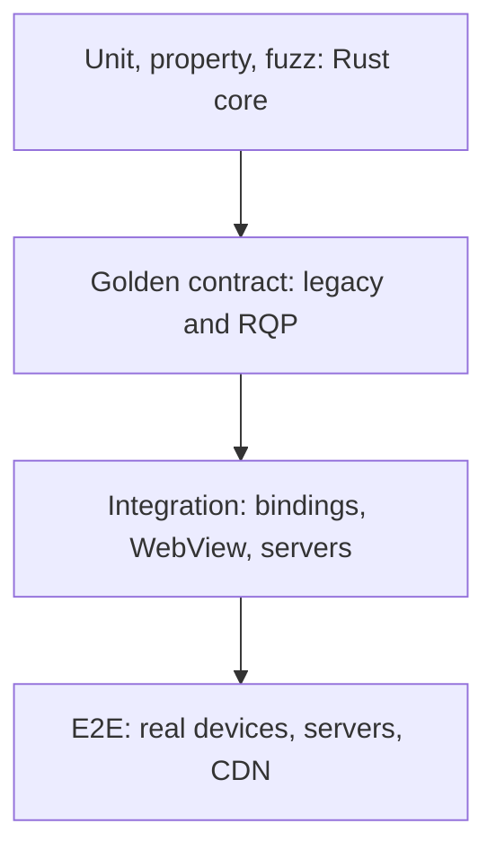

# Test strategy

Rivqen proves behavior with tests at four levels. Functional correctness is a hard gate. A green unit-test run alone never closes a task that needs a device test.

**Status:** <Badge type="info" text="DESIGN" />

[[toc]]

## 1. Test pyramid

| Level | Runs | Speed | Purpose |
|---|---|---|---|
| Unit / property / fuzz | Every PR, host machine | Seconds–minutes | Invariants of parser, FSM, cache, diff |
| Golden contract | Every PR | Minutes | Same decisions for all implementations |
| Integration | Every PR (emulators/simulators) | 10–30 min | Bindings, WebView behavior, servers |
| E2E on devices | Nightly + release | Hours | Real WebViews, networks, memory |

## 2. Test suites

| Suite | Scope | Pass criterion |
|---|---|---|
| `legacy-android` | Upstream Android behavior, Quick and Standard | Matches golden traces captured from upstream |
| `legacy-ios` | Upstream iOS behavior where it still runs | Observable parity; differences documented |
| `server-cross-language` | Java / Node.js / PHP / Rust oracle | Same decisions and payloads for each fixture |
| `rust-core-unit` | FSM, validators, cache, parser, diff | All invariants; ≥ 90 % line coverage for critical crates (guideline, not a goal by itself) |
| `fuzz-protocol` | Markers, JSON, frames, compression | No panic, no UB, no unbounded allocation, no infinite loop |
| `ffi-lifecycle` | Close, cancel, re-entrancy, threads | No use-after-free, no leak, no deadlock |
| `android-e2e` | WebView versions and API levels | First render, navigation, cookies, offline correct |
| `ios-e2e` | Supported iOS versions | Correct; limitations explicit |
| `react-ssr` | Hydration, streaming SSR, re-render | No double insertion, no mismatch, no unsafe HTML |
| `transport-chaos` | H1/H2/H3, disconnect, captive portal, WS/WT fallback | Deterministic safe retry; HTTPS resync |
| `security` | XSS, SSRF, cache poisoning, bridge isolation | No unresolved critical/high finding |
| `cache-faults` | kill -9, disk full, corruption, logout, account change | No cross-account mixing; atomic consistency |
| `performance` | Cold, warm, delta, full, offline | Positive or neutral vs agreed baselines |

## 3. Property-based invariants

| # | Invariant |
|---|---|
| 1 | `decode(encode(template, data)) == (template, data)` for the valid subset |
| 2 | `render(template, extract(html)) == html` for HTML accepted by the grammar |
| 3 | `apply(rev_n, patch(n → n+1)) == rev_(n+1)` |
| 4 | A patch with `base ≠ current` changes no byte of the committed snapshot |
| 5 | A commit interrupted at any point leaves old-valid **or** new-valid, never a hybrid |
| 6 | Concurrent sessions in different partitions never share private payloads |
| 7 | After `cancel(session)`, every later UI action is a no-op |
| 8 | Bounded input → bounded RAM and CPU; violations end safely |

Tools: `proptest` (Rust), `cargo-fuzz` (libFuzzer), Miri for `unsafe` code, Kotest property tests (Kotlin), Swift Testing parameterized tests, `fast-check` (TypeScript).

## 4. Golden fixtures

Golden fixtures are the shared truth for every implementation. See [Golden fixtures](/engineering/protocol/fixtures).

## 5. Test environments

| Environment | Use |
|---|---|
| Lab HTML server + network shaper | Control RTT, loss, bandwidth, disconnects, H3→H2 downgrade |
| Android emulators (several API levels) | Integration in CI |
| iOS simulators | Integration in CI |
| Device farm (low, mid, high-end) | E2E, performance, memory (nightly) |
| CDN / proxy lab (Nginx, Envoy, one CDN) | Server conformance through intermediaries |

::: warning Simulators are not enough
Simulators do not show real performance, memory or streaming behavior. Release decisions need device results.
:::

## 6. Rules for AI and humans

- Do not change a legacy fixture to make new code pass.
- Do not mark a task done because the code compiles.
- Do not count unit tests as a substitute for a required device test.

## Related

- [Benchmarks](/engineering/quality/benchmarks)
- [Golden fixtures](/engineering/protocol/fixtures)
