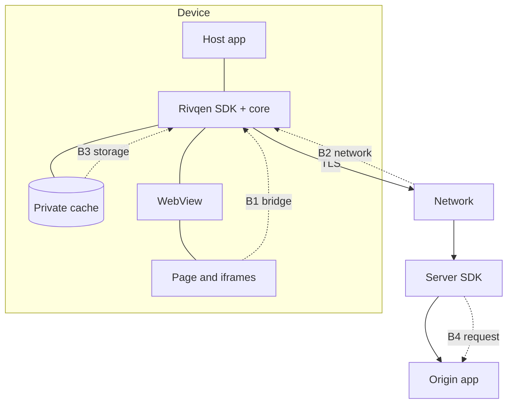

# Threat model

This page lists what Rivqen protects, who can attack it, where the trust boundaries are, and which threats the design must stop.

**Status:** <Badge type="info" text="DESIGN" /> Owner: security engineer (WP-18). Review at each phase gate.

[[toc]]

## 1. Assets

| Asset | Why it matters |
|---|---|
| User session (cookies, tokens) | Account takeover |
| Cached pages of a user | Private data disclosure |
| Page integrity (what the user sees) | Fraud, phishing, wrong prices or balances |
| Native capabilities exposed by the JS bridge | Code execution or data access from web content |
| Server origin (for server SDKs) | SSRF, cache poisoning of shared caches |
| Device resources (memory, CPU, battery, data) | Denial of service; user cost |
| Release artifacts | Supply-chain compromise |

## 2. Attackers

| Attacker | Capabilities |
|---|---|
| Network attacker | Observes and modifies traffic on untrusted networks; cannot break TLS |
| Malicious web content | Controls an iframe, a third-party script, a redirect target, or an HTML fragment |
| Malicious or compromised upstream | Returns crafted HTML, headers, diffs or push messages |
| Second user on the same device | Logs in after the first user on a shared device |
| Local attacker with file access | Reads app files on a rooted/jailbroken or backed-up device |
| Supply-chain attacker | Compromises a dependency or a build step |

## 3. Trust boundaries

| Boundary | Untrusted side | Main checks |
|---|---|---|
| B1 JS bridge | Web content in any frame | Real frame origin (from the platform API), message schema, allowlist of commands |
| B2 Network | All responses and push messages | TLS (system validation), size limits, schema, revision, integrity |
| B3 Storage | Files on disk | Integrity on read, AEAD for private entries, partition check |
| B4 Server request | Client requests to the server SDK | No fetch of client-supplied URLs; tenant context; header injection checks |
| B5 Partition | Another account on the same device | Partition in every key; revoke on logout |

## 4. Threats and mitigations

| # | Threat | Boundary | Mitigation (controls) |
|---|---|---|---|
| T-01 | XSS through a data block or patch | B2 | No script in patches; context-aware insertion; CSP (SEC-03, SEC-04, SEC-17) |
| T-02 | Bridge abuse from a third-party iframe | B1 | Frame-origin check by native API; command allowlist (SEC-02, SEC-16) |
| T-03 | Cross-account cache read | B5 | Partitioned keys, revoke on logout (SEC-05, SEC-18) |
| T-04 | Replay of an old patch | B2 | Base revision + sequence + generation (SEC-09, SEC-20) |
| T-05 | Cache poisoning via shared CDN | B4 | `Cache-Control: private`, `Vary`, no 304 on identity mismatch (SEC-06) |
| T-06 | Decompression bomb / huge document | B2 | Size and ratio limits (SEC-07, SEC-23) |
| T-07 | Slow-loris stream | B2 | Deadlines and backpressure (SEC-07) |
| T-08 | TLS bypass "for speed" | B2 | System validation only; no custom trust (SEC-01, SEC-21) |
| T-09 | Downgrade to weaker legacy behavior | B2 | Downgrade only by app policy (SEC-10) |
| T-10 | Secrets in logs | all | Redaction; log privacy tests (SEC-08, SEC-25) |
| T-11 | Read of cache files from backup or rooted device | B3 | AEAD + Keystore/Keychain keys; no backup (SEC-13, SEC-19) |
| T-12 | SSRF through server middleware | B4 | Never fetch URLs from the request (SEC-14) |
| T-13 | Memory corruption in FFI | B1/B2 | Safe Rust, minimal `unsafe`, fuzzing, Miri (SEC-22) |
| T-14 | Dependency compromise | build | Lockfiles, SBOM, `cargo-deny`, signed releases (SEC-12, SEC-24) |
| T-15 | Stale private page shown after TLS error | B2 | No sensitive stale on `TLS_ERROR` (SEC-06) |

## 5. Out of scope

- A fully compromised device (root/jailbreak with code injection) can read process memory. Rivqen limits secret lifetime but cannot stop this.
- Bugs in the WebView engine itself.
- Malicious host apps.

## Related

- [Security controls](/engineering/security/controls)
- [Research: WebView security literature](/research/literature#webview-and-hybrid-app-security)
