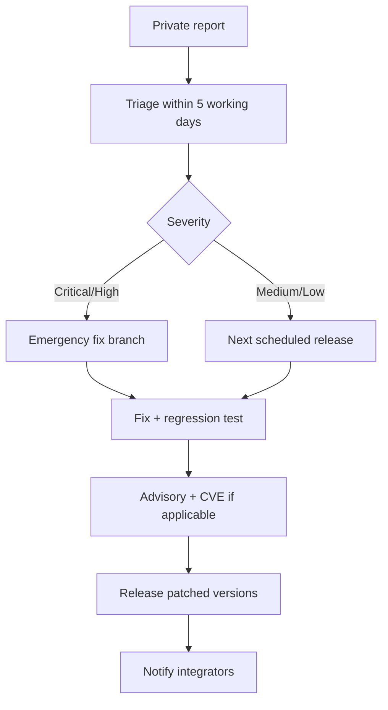

# Vulnerability management

This page defines how Rivqen receives, fixes and announces vulnerabilities (`PATCH-001`).

**Status:** <Badge type="info" text="DESIGN" /> The public entry point is [SECURITY.md](https://github.com/robotoss/rivqen/blob/main/SECURITY.md).

## 1. Process

## 2. Steps

1. Receive the report through GitHub private vulnerability reporting.
2. Confirm receipt within 5 working days.
3. Assess severity with CVSS v4 and the Rivqen threat model.
4. Identify affected versions from the build records (`BUILD-ID-001`).
5. Fix on a private branch. Add a regression test.
6. Prepare a GitHub Security Advisory: affected versions, fixed versions, workaround, credit.
7. Release patched versions of all supported lines.
8. Publish the advisory. Request a CVE when applicable.

## 3. Targets

| Severity | Fix target | Notes |
|---|---|---|
| Critical | 7 days | Out-of-band release |
| High | 30 days | Out-of-band release if exploited |
| Medium | Next minor release | |
| Low | Next planned release | |

## 4. Remote mitigation

The SDK provides a documented **kill switch** controlled by the host app (for example, `killSwitch.disabledOrigins`, or a feature flag the host app fetches from its own backend). The kill switch only **disables** a feature. Rivqen never downloads or executes code.

## 5. Supported versions

Before 1.0: only the latest `0.x` minor release. From 1.0: the latest minor of the current major, and the previous major for 6 months after a new major.

## 6. Exercises

Run a tabletop exercise with a mock CVE before the public beta. Check that maintainers can find affected app builds from records alone.
