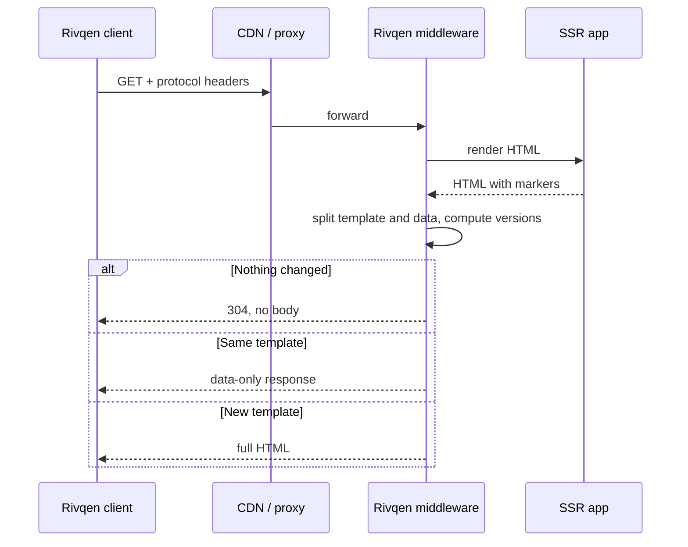

# Server SDKs overview

Server SDKs prepare pages for Rivqen clients: they find data blocks, compute versions, and answer with a full page, a `304`, or a data-only response. Rivqen provides SDKs for Node.js, Java and PHP, plus a Rust reference server used as the test oracle.

**Status:** <Badge type="info" text="DESIGN" />

[[toc]]

## 1. Shared requirements

| ID | Requirement |
|---|---|
| `S-001` | All server SDKs produce the same decisions and payloads for the same fixture. |
| `S-002` | The middleware does not change responses for clients that do not use Rivqen. |
| `S-003` | SSR-aware markup supports dynamic blocks. |
| `S-004` | Cache headers, auth, `Vary`, compression and CDN behavior are tested end to end. |
| `S-005` | Each SDK works with the common frameworks of its language (adapters), not one framework only. |
| `S-006` | Memory and CPU limits are documented. Large pages are streamed or buffered with a bound. |
| `S-007` | The middleware never fetches URLs taken from the request (no SSRF surface). |
| `S-008` | Errors never expose stack traces in HTTP responses. |

## 2. Implementation strategy (ADR-010)

| Option | Strengths | Weaknesses | Decision |
|---|---|---|---|
| Native-language SDKs + shared conformance | Simple install (npm, Maven, Composer); no native extensions | Three implementations of the algorithm | **Primary** |
| Rust FFI in each language (N-API, JNI, PHP extension) | One algorithm | Hard to install and support on many hosts | Not for the MVP |
| Rust sidecar service | One engine for all servers | Extra process, IPC latency, ops cost | Optional, for high load |

The Rust core is mandatory for **mobile** clients. Server SDKs implement the **specification** and pass the **fixtures**; they do not link the Rust core.

## 3. Request flow

## 4. Language SDKs

| SDK | Package (working) | Framework adapters | Page |
|---|---|---|---|
| Node.js / TypeScript | `@rivqen/server` | Fetch API, Express, Fastify, Next.js | [Node.js](/engineering/server/node) |
| Java | `dev.rivqen:rivqen-server` | Jakarta Servlet filter, Spring Boot starter; Netty/Vert.x later | [Java](/engineering/server/java) |
| PHP | `rivqen/rivqen-server` | PSR-15 middleware (PSR-7/PSR-17) | [PHP](/engineering/server/php) |
| Rust | `server/rust-reference` | Standalone server and conformance oracle | [Conformance](/engineering/server/conformance) |

## Related

- [CDN and proxies](/engineering/server/cdn)
- [Legacy protocol wire contract](/engineering/protocol/legacy-wire)
