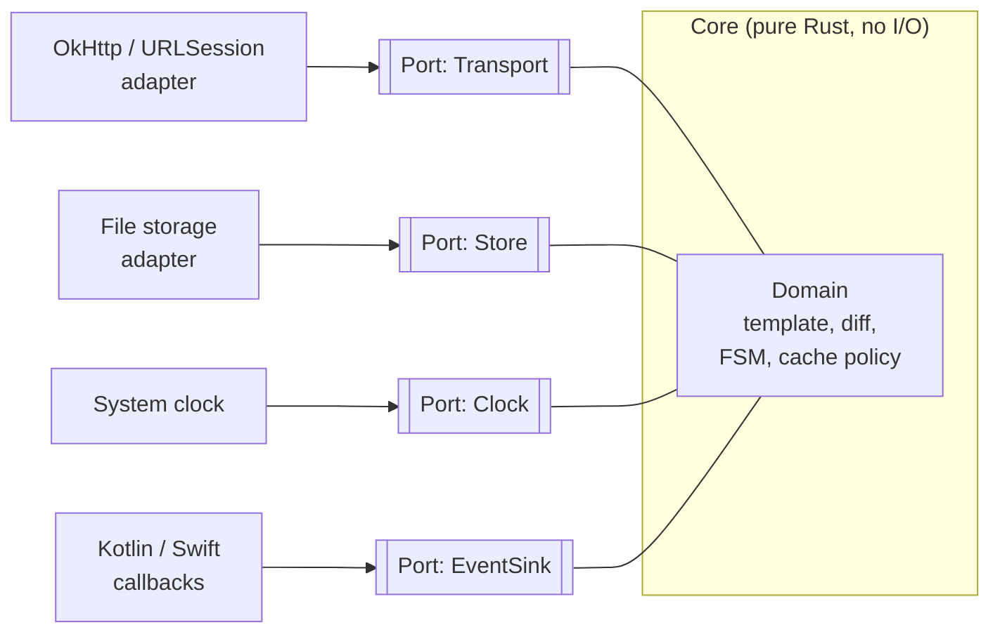

# Coding standards

These standards apply to all Rivqen code, written by humans or by AI agents. Each language has its own page. The `.claude/rules/` files in the repository are short checklists of these pages.

**Status:** <Badge type="info" text="DESIGN" /> in force from WP-24 · tool versions are checked at each WP kickoff

[[toc]]

## 1. Architecture: ports and adapters

Rivqen uses a **ports-and-adapters** (hexagonal) architecture with a **sans-I/O** core. The core decides; the adapters do the I/O.

| Layer | Contains | Must not contain |
|---|---|---|
| **Domain** | Types, rules, state machines, pure functions | I/O, threads, clocks, global state, platform types |
| **Ports** | Traits / interfaces that the domain needs | Implementation details |
| **Adapters** | Network, storage, clock, UI and FFI bindings | Business rules |
| **Composition root** | Wiring of adapters to ports (one place per SDK) | Logic |

Rules:

1. Dependencies point inward. The domain does not import an adapter.
2. The domain takes inputs (events, bytes, time) and returns outputs (actions, effects). It does not call the network or the disk.
3. Each port has a fake for tests. Domain tests run without I/O and without sleeps.
4. One composition root per SDK. No service locator, no hidden singletons. The engine object is created by the app.
5. Platform SDKs (Kotlin, Swift, TypeScript) are thin: they adapt the platform to the core. They do not copy core logic.
6. Server SDKs keep a pure core function (`HTML in → decision out`) and thin framework adapters (Express, Servlet, PSR-15).

Sources: A. Cockburn, *Hexagonal Architecture* (2005); the [Sans-I/O](https://sans-io.readthedocs.io/) pattern; G. Bernhardt, *Functional Core, Imperative Shell* (2012).

## 2. Patterns we use

| Pattern | Where | Why |
|---|---|---|
| State machine as `enum` + pure transition function | Session FSM, stream parser | All states and transitions are explicit and testable |
| Newtype for IDs and units | `BlockId`, `Revision`, `PartitionId`, byte sizes | No mix-ups between strings and numbers |
| Typed errors with context | All layers | See [Errors and logging](/engineering/architecture/errors-logging) |
| Builder or config struct with defaults | Engine and SDK configuration | Readable, forward-compatible configuration |
| Strategy behind a trait | Protocol mode (RQP / legacy), transports | Add or remove a mode without touching the core flow |
| Observer / stream of events | Session outcomes to the app | No callbacks into the core from UI threads |
| Constructor injection | Adapters into the core | Testable without globals |
| Parse, don't validate | Untrusted input → typed values at the boundary | Invalid data cannot reach the domain |

## 3. Anti-patterns

| Do not | Instead |
|---|---|
| Global mutable state, singletons | Pass the dependency in |
| Boolean parameters that change behavior | An `enum` or two functions |
| Stringly-typed data inside the core | Newtypes and enums |
| Catch-all error handling that drops the cause | Propagate with context |
| Inheritance trees for variation | Composition and traits/interfaces |
| Generic abstractions with one user | Concrete code; abstract at the second user |
| Comments that repeat the code | Names that explain; comments that explain *why* |

## 4. Rules for every language

1. **Formatting is automatic.** Use the formatter of the language. Do not argue about style in review.
2. **Lints are errors in CI.** No new warning is merged. A suppression needs a comment with the reason.
3. **No ignored errors.** Every result is handled or propagated with context.
4. **No secrets or personal data** in code, tests, fixtures or logs.
5. **Public API is documented** with one example.
6. **Small units.** A function does one thing. A file has one responsibility.
7. **Names** follow the language convention; domain words follow the [glossary](/guide/glossary).
8. **Dependencies:** pinned, license checked ([Licensing](/legal/licensing)), minimal. A new license class is a human decision.
9. **Tests:** behavior-focused, deterministic, no sleeps, no network in unit tests. See [Mutation testing](/engineering/quality/mutation).

## 5. Language pages

| Language | Used for | Page |
|---|---|---|
| Rust | Core, FFI, reference server | [Rust](/engineering/standards/rust) |
| Kotlin | Android SDK | [Kotlin](/engineering/standards/kotlin) |
| Swift | iOS SDK | [Swift](/engineering/standards/swift) |
| TypeScript | Web SDK, Node.js server SDK, demos | [TypeScript](/engineering/standards/typescript) |
| Java | Java server SDK | [Java](/engineering/standards/java) |
| PHP | PHP server SDK | [PHP](/engineering/standards/php) |

## Related

- [AI development](/engineering/ai/)
- [Errors and logging](/engineering/architecture/errors-logging)
- [Invariants](/engineering/architecture/invariants)
