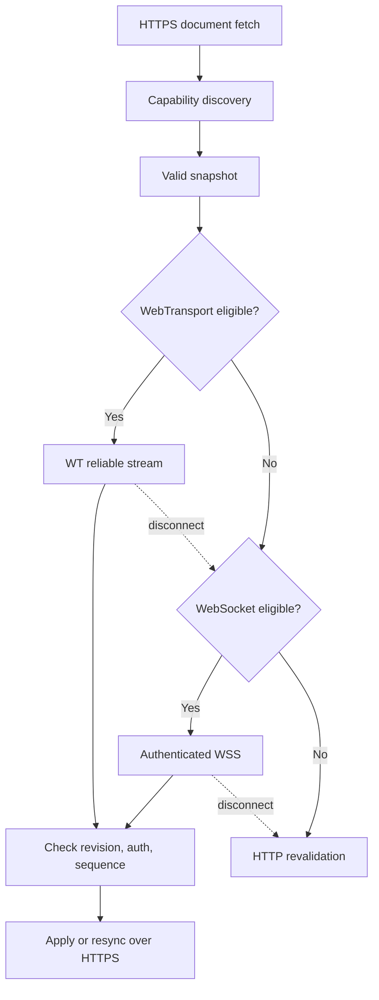

# Transport overview

Rivqen separates the **protocol** (what the messages mean) from the **transport** (how bytes travel). This page defines which transport carries which kind of traffic.

**Status:** <Badge type="info" text="DESIGN" />

[[toc]]

## 1. Protocol vs transport

| Layer | Examples | Defines |
|---|---|---|
| Rivqen protocol | Legacy protocol, Rivqen protocol | Markers, headers, revisions, diff and patch rules |
| HTTP | HTTP/1.1, HTTP/2, HTTP/3 | Requests and responses; caching; conditional requests |
| Realtime | WebSocket (WSS), WebTransport | Long-lived channels for push signals and patches |
| Network | TCP + TLS, QUIC | Bytes, encryption, congestion control |

::: info Quick is not QUIC
`QuickSonicSession` is an upstream **client mode** name. QUIC is a **network protocol** (RFC 9000). They are not related.
:::

## 2. Transport assignment

| Transport | First HTML render | Data update | Invalidation / push | Priority |
|---|---|---|---|---|
| **HTTPS over HTTP/2 or HTTP/3** | **Yes, primary** | **Yes, primary** | Poll / conditional revalidation | P0 |
| **HTTPS over HTTP/1.1** | Yes | Yes | Poll / revalidation | P0 fallback |
| **WebSocket (WSS)** | No (not a browser navigation) | Yes, after an initial snapshot | **Yes** | P1 |
| **WebTransport over HTTP/3** | Only after a proof of correctness | Yes, reliable streams | Yes | P2, experimental |
| **QUIC / HTTP datagrams** | **No** | **No** for mandatory patches | Only for non-essential hints | P3, optional |

::: danger Never send a mandatory patch as a datagram
Datagrams can be lost or reordered. A mandatory update uses a reliable stream or an HTTP response.
:::

## 3. Negotiation flow

The diagram shows how a client selects a realtime channel after the first document.

HTTP/1.1, HTTP/2 and HTTP/3 selection is done by the platform HTTP stack (ALPN, Alt-Svc). Rivqen does not force a version.

## 4. Rules

| ID | Rule |
|---|---|
| `T-01` | The first document is **always** available over normal HTTPS. |
| `T-02` | A realtime endpoint is a separate capability with an origin, authentication, TLS and an allowed port. |
| `T-03` | Realtime channels use short-lived subscriptions, heartbeat, reconnect with exponential backoff and jitter, and a connection limit. |
| `T-04` | A missed message, a disconnect or a sequence gap leads to an HTTPS revalidation and, if needed, a full snapshot. |
| `T-05` | Do not use QUIC 0-RTT for requests that change state or depend on private context, unless a replay analysis approves it. |
| `T-06` | Proxies, captive portals, VPNs, battery saver and background limits never cause a functional failure. |
| `T-07` | On a weak network, prefer **fewer connections**. Do not start all transports at once. |
| `T-08` | Transport fallback never weakens auth, origin, CSP, memory limits or cache rules. |

## Pages in this section

- [HTTP stacks](/engineering/transport/http)
- [Realtime channels](/engineering/transport/realtime)
