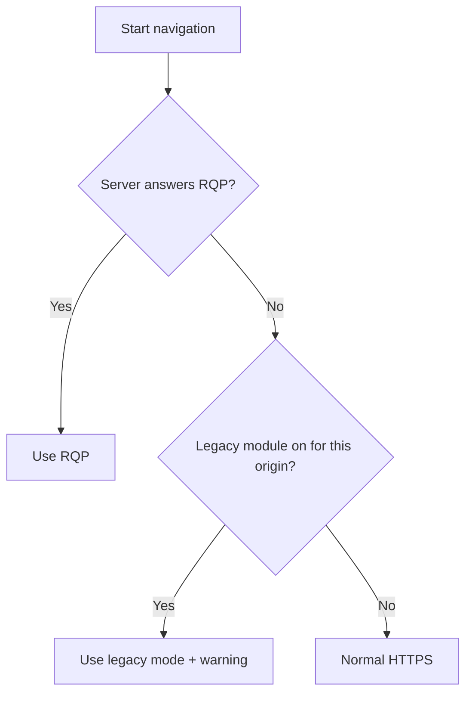

# Protocol modes

Rivqen has one main protocol and one temporary compatibility mode.

| | Rivqen protocol (RQP) | Legacy mode |
|---|---|---|
| Purpose | The protocol for all new integrations | Migration from existing VasSonic servers and pages |
| Default | **Yes** | No (optional module) |
| Block markup | `data-rq-block="name"` attribute on a normal HTML element | HTML comments `<!--sonicdiff-name-->…<!--sonicdiff-name-end-->` |
| Version tracking | Page revision and template revision in a manifest | `etag` and `template-tag` headers |
| Data update | Only changed blocks, as a validated patch | Server sends all blocks |
| Replay protection | Base revision and sequence number | Limited |
| Push updates | Optional (WebSocket; WebTransport experimental) | No |
| Lifetime | Long-term | **Deprecated from 1.0, removed in 1.5** |

## How the mode is chosen

## Which mode to use

| Your situation | Use |
|---|---|
| You start a new integration | RQP. |
| You run VasSonic servers today | Legacy mode for the transition, then migrate pages to `data-rq-block` with the `rivqen-migrate` tool before 1.5. |
| You cannot change the server | Neither. Rivqen still starts the download early and uses HTTP caching. |

## Legacy timeline

| Rivqen release | Legacy mode |
|---|---|
| 1.0 | Available, deprecated, warnings on use |
| 1.1 – 1.3 | Security fixes only |
| 1.4.x | Last release with legacy modules |
| 1.5 | Removed |

Rivqen never moves from RQP to legacy mode silently. Your app must install the legacy module and list the origins in `legacy.allowedOrigins`.

## Related

- [Migrate from VasSonic](/guide/migrate-from-vassonic)
- [Engineering: modes and legacy deprecation](/engineering/protocol/versioning)
