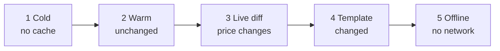

# Examples

This section describes the example apps. Each example shows the same page — a shop catalog — in five states, so you can compare platforms side by side.

**Status:** <Badge type="tip" text="FACT" /> server demo runs today · <Badge type="info" text="DESIGN" /> mobile and web demos are planned (WP-22)

[[toc]]

## 1. What is ready

| Example | Folder | State | What you can do now |
|---|---|---|---|
| [Server](/guide/examples/server) | `examples/server-demo` | **Runs**, 14 tests pass | Start it, send RQP requests, measure bytes |
| [Android](/guide/examples/android) | `examples/android-demo` | Planned (P5) | Read the screen plan and the planned API |
| [iOS](/guide/examples/ios) | `examples/ios-demo` | Planned (P5) | Read the screen plan and the planned API |
| [Web](/guide/examples/web) | `examples/web-demo` | Planned (P6) | Read the screen plan and the planned API |

::: warning Planned code
Code on the Android, iOS and Web pages uses the **planned API**. It does not compile yet. The API can change before 1.0.
:::

## 2. One scenario for all platforms

All demos use the catalog page from the server demo. The page has a large stable template (about 20 KB) and four small blocks: `title`, `price`, `stock` and `cart`.

| # | Screen | Server action | Expected result |
|---|---|---|---|
| 1 | **Cold** | None | Full HTML with the manifest. Rivqen stores the template. |
| 2 | **Warm** | None | Cached page shows at once. Revalidation returns `304`. |
| 3 | **Live diff** | `POST /__demo/next-data` | Cached page shows first. A patch updates `price`, `stock`, `title` and `cart`. |
| 4 | **Template changed** | `POST /__demo/next-template` | Full HTML. Rivqen replaces the template. |
| 5 | **Offline** | Stop the server | Cached page shows with an "offline" mark, if the policy allows offline. |

## 3. Common controls

Each mobile and web demo has the same control panel:

| Control | Effect |
|---|---|
| **Open page** | Opens the catalog in a new session |
| **Change data** | Calls `POST /__demo/next-data` |
| **Change template** | Calls `POST /__demo/next-template` |
| **Clear cache** | Calls `clearCache` for the demo partition |
| **Rivqen on / off** | Opens the same page in a plain web view, for comparison |
| **Event log** | Shows session outcomes: `FirstLoad`, `CacheHitNotModified`, `DataUpdated`, `TemplateChanged`, `ServedStale`, `Fallback` |
| **Timings** | Shows time to first content and transferred bytes for the last visit |

## 4. What each example measures

| Metric | Server | Android | iOS | Web |
|---|---|---|---|---|
| Transferred bytes per visit | Yes (`npm run measure`) | Yes | Yes | Yes |
| Time to first content | — | Yes | Yes | Yes |
| Patch apply time | — | Yes | Yes | Yes |
| Fallback count | Logs | Events | Events | Events |

See [Performance](/guide/performance) for the measured bytes and an interactive timing model.

## Related

- [Getting started](/guide/getting-started/)
- [WP-22 — Demos and examples](/engineering/plan/work-packages#wp-22)
