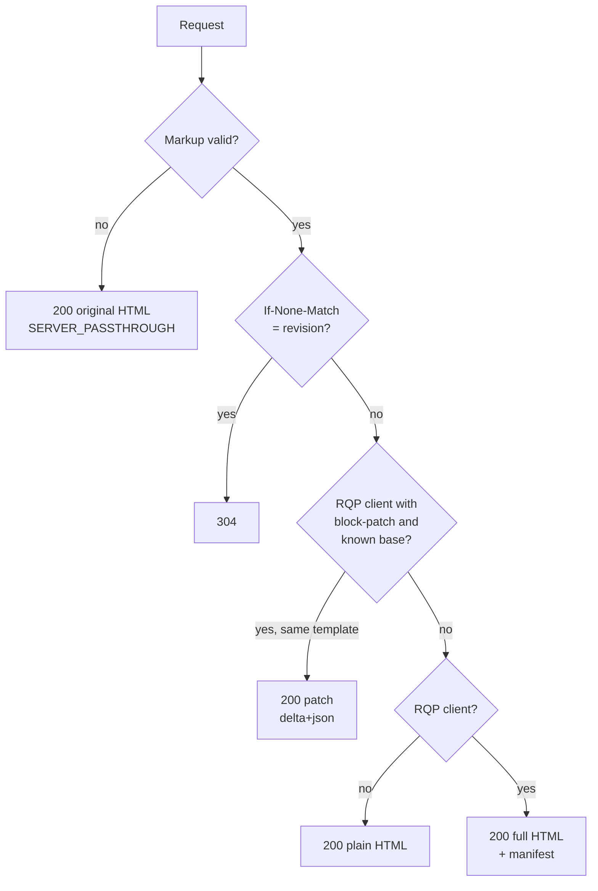

# Example: Server

`examples/server-demo` is a small Node.js server. It shows the Rivqen protocol (RQP) from the server side: block markup, manifest, `304`, block patch and safe fallback.

**Status:** <Badge type="tip" text="FACT" /> runs today · reference behavior for WP-17, not the final server SDK

[[toc]]

## 1. Requirements

- Node.js 22 or later
- No other services. The server stores state in memory.

## 2. Start the server

1. Go to the example folder.
2. Install the dependencies.
3. Start the server.

```bash
cd examples/server-demo
npm install
npm start
```

4. Make sure that the server writes `server.started` to the log.

The server listens on `127.0.0.1:8787`. To change the port, set `PORT`.

## 3. Endpoints

| Method | Path | Result |
|---|---|---|
| `GET` | `/catalog` | The demo page: full HTML, `304`, or a patch |
| `POST` | `/__demo/next-data` | Changes price and stock. Localhost only. |
| `POST` | `/__demo/next-template` | Adds a menu item (template change). Localhost only. |
| `GET` | `/healthz` | `{ "ok": true, "state": … }` |

## 4. How the server answers `/catalog`



## 5. Try it by hand

1. Get the full page as an RQP client. Copy the `Rq-Revision` value.

```bash
curl -si http://127.0.0.1:8787/catalog \
  -H 'Rq-Version: 1' -H 'Rq-Capabilities: (block-patch manifest)' | head -20
```

2. Change the data.

```bash
curl -s -X POST http://127.0.0.1:8787/__demo/next-data
```

3. Ask for a patch from your revision. Replace `rev-…` with the value from step 1.

```bash
curl -s http://127.0.0.1:8787/catalog \
  -H 'Rq-Version: 1' -H 'Rq-Capabilities: (block-patch manifest)' \
  -H 'Rq-Base-Revision: "rev-…"' -H 'If-None-Match: "rev-…"'
```

4. Make sure that the response has `Content-Type: application/vnd.rivqen.delta+json` and only the changed blocks.

## 6. Run the tests

```bash
npm test
```

The 14 tests check block discovery, stable revisions, patch content, the refusal of patches across template changes, all `RQP_MARKUP_*` errors, the manifest and the request header parser.

## 7. Measure bytes

1. Start the server in one terminal.
2. Run the measurement in another terminal.

```bash
npm run measure -- --out ../../evidence/benchmarks/rqp-bytes.json
```

The script makes four visits (cold, unchanged, data changed, template changed) with three strategies: plain, HTTP ETag and RQP. To add the upstream legacy server, set `LEGACY_URL` and `LEGACY_PAGES` (see `tools/upstream-lab`).

The latest results are on the [Performance](/guide/performance#measured-bytes) page.

## 8. Logs and errors

The server writes one JSON line per event. It follows [Errors and logging](/engineering/architecture/errors-logging):

- Each request has a `request_id`, `mode` (`plain`, `full`, `patch`, `304`, `passthrough`) and `duration_ms`.
- Only allowlisted fields go to the log. Query strings are removed from paths.
- If the markup is invalid, the server logs `rqp.analyze_failed` with the error code and sends the original HTML. The page never breaks.

## 9. Limits of the demo

- State is in memory. A restart clears the revision history.
- The server keeps the last 16 revisions per path. An older base gets the full page.
- It is not a production server. Use the server SDKs when they are released.

## Related

- [Markup](/engineering/protocol/markup)
- [Negotiation](/engineering/protocol/negotiation)
- [Manifest and patch](/engineering/protocol/manifest-patch)
