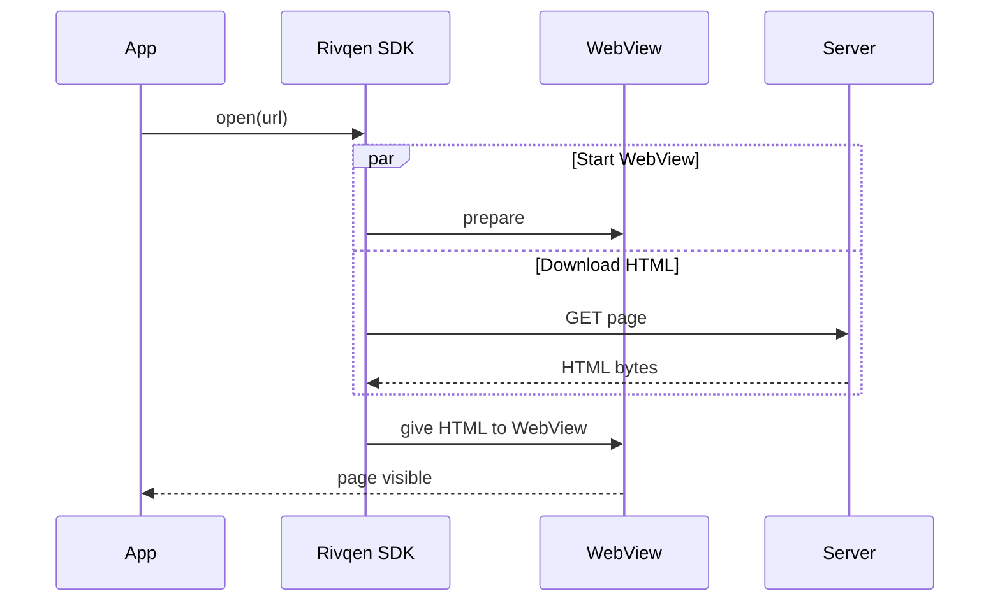
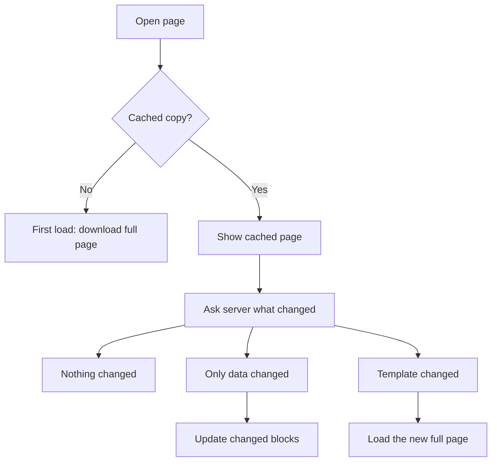

# How it works

This page explains the main idea of Rivqen in five minutes. For full detail, see the [Engineering handbook](/engineering/).

## 1. Start the download early

Without Rivqen, the steps happen one after another. With Rivqen, the download and the WebView start happen at the same time.



On Android, the SDK gives the bytes to the WebView as a stream, so the WebView can render before the download ends. On iOS, the method depends on what the platform allows. See [Support matrix](/guide/support-matrix).

## 2. Split the page into template and data

The server marks the parts of the page that change often with the `data-rq-block` attribute. Rivqen calls them **data blocks**. The rest of the page is the **template**.

```html
<html>
  <body>
    <header>Shop</header>
    <p class="price" data-rq-block="price">120.00</p>
  </body>
</html>
```

The template is stored once. When only the price changes, the server sends only the new price. See [Template and data](/guide/concepts/template-and-data).

## 3. Four outcomes on a repeat visit

When the user opens a page again, Rivqen shows the cached page and asks the server what changed. There are four possible answers.



| Outcome | What the user sees | Data sent |
|---|---|---|
| First load | The page appears as it downloads | Full page |
| Nothing changed | The cached page at once | Headers only |
| Only data changed | The cached page at once, then the new values | Changed blocks only |
| Template changed | The new page | Full page |

## 4. Fall back when anything fails

If any check fails, Rivqen loads the page in the normal way. The user sees the page, never a blank screen. Examples: a broken response, a timeout, a cache error, an unsupported server.

## 5. Keep users separate

Rivqen stores cached pages per account. When a user logs out, Rivqen deletes access to that user's pages at once. One user never sees another user's cached page.

## Next steps

- [Concepts](/guide/concepts/)
- [Getting started](/guide/getting-started/)
