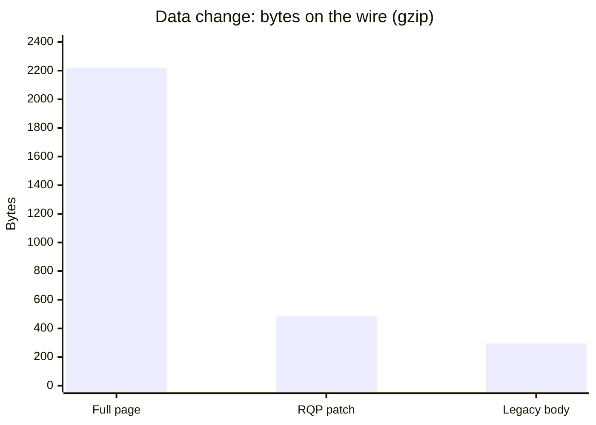

# Performance

This page shows two things: **measured** bytes from the server demo, and an **interactive model** of load time. They are different kinds of evidence. Do not mix them.

**Status:** <Badge type="tip" text="FACT" /> byte table is measured · <Badge type="warning" text="RESEARCH" /> timing is a model until the device stand runs (WP-19)

[[toc]]

## 1. Where the speed-up comes from

Rivqen saves time in three ways:

1. **Parallel start.** The page request starts at the same time as the web view. A plain web view starts the request only after it is ready.
2. **Cache first.** On a revisit, the cached page shows at once. Revalidation runs in the background.
3. **Small updates.** When only data changes, only the changed blocks travel. The template stays in the cache.

Rivqen does **not** make the first visit smaller. The first visit carries the manifest, so it is a little larger (see the table below).

## 2. Interactive model

Select a scenario and move the sliders. The bars show when each step runs. The red line marks first content.

<ClientOnly>
  <LoadTimeline />
</ClientOnly>

### Formulas

The model uses these formulas. All values are in milliseconds.

| Term | Formula |
|---|---|
| Handshake | `2 × RTT` (TCP + TLS 1.3), or `0` with a reused connection |
| Transfer | `size_bytes × 8 ÷ bandwidth_bps × 1000` |
| Fetch | `handshake + RTT + server + transfer` |
| Plain, first content | `webview_init + fetch(full) + render` |
| Rivqen cold, first content | `max(webview_init, fetch(full)) + render` |
| Rivqen warm, first content | `max(webview_init, cache_read) + render` |

::: warning Limits of the model
The model has no DNS time, no TCP slow start, no CPU contention, no JavaScript cost and no WebView process start variance. Real gains are smaller on fast networks and with a pre-warmed web view. Use it to understand the mechanism, not to promise a number.
:::

## 3. Measured bytes {#measured-bytes}

Source: `evidence/benchmarks/rqp-bytes.json`, made with `npm run measure` in [`examples/server-demo`](/guide/examples/server). Page: the demo catalog, 19,538 bytes of HTML with four blocks (`title`, `price`, `stock`, `cart`). Compression: Node.js zlib defaults.

### Body bytes per visit (gzip)

| Visit | Plain (no revalidation) | HTTP ETag | Rivqen (RQP) | RQP response |
|---|---:|---:|---:|---|
| 1. Cold | 2,221 | 2,221 | 2,661 | Full HTML + manifest |
| 2. Revisit, unchanged | 2,221 | 0 | 0 | `304` |
| 3. Data changed | 2,220 | 2,220 | **484** | Patch, 4 blocks |
| 4. Template changed | 2,240 | 2,240 | 2,679 | Full HTML + manifest |

### All encodings for the data change

| Strategy | Raw | gzip | Brotli |
|---|---:|---:|---:|
| Full page (plain, ETag) | 19,538 | 2,220 | 1,216 |
| Rivqen patch (RQP) | 869 | 484 | 406 |
| Legacy data body (upstream server, same page) | 512 | 295 | 253 |

### What the numbers say

1. On a data change, the RQP patch is **78 % smaller** than the full page with gzip (484 vs 2,220 bytes) and 67 % smaller with Brotli.
2. On an unchanged revisit, RQP and plain HTTP ETag are equal: both send `304`. The gain there is time (cache first), not bytes.
3. On the first visit and on a template change, RQP is about **440 bytes larger** with gzip. This is the manifest.
4. The RQP patch is **larger than the legacy data body** (869 vs 512 bytes raw). The cause is per-block SHA-256 values (64 hex characters each) and envelope fields. This is open question [Q-15](/engineering/plan/open-questions).

::: info Bytes are not time
These values count body bytes only, without headers and TLS framing. For a small page on a fast network, the byte saving changes little. The saving grows with page size, slow networks and frequent data changes.
:::

## 4. Next measurements

The device stand (WP-19) will measure time to first content, LCP, energy and memory on real Android and iOS devices. The method is in [Benchmarks](/engineering/quality/benchmarks): at least 30 runs per scenario, p50/p90/p95, bootstrap confidence intervals, raw traces published.

## Related

- [How it works](/guide/how-it-works)
- [Examples](/guide/examples/)
- [Engineering: Benchmarks](/engineering/quality/benchmarks)
