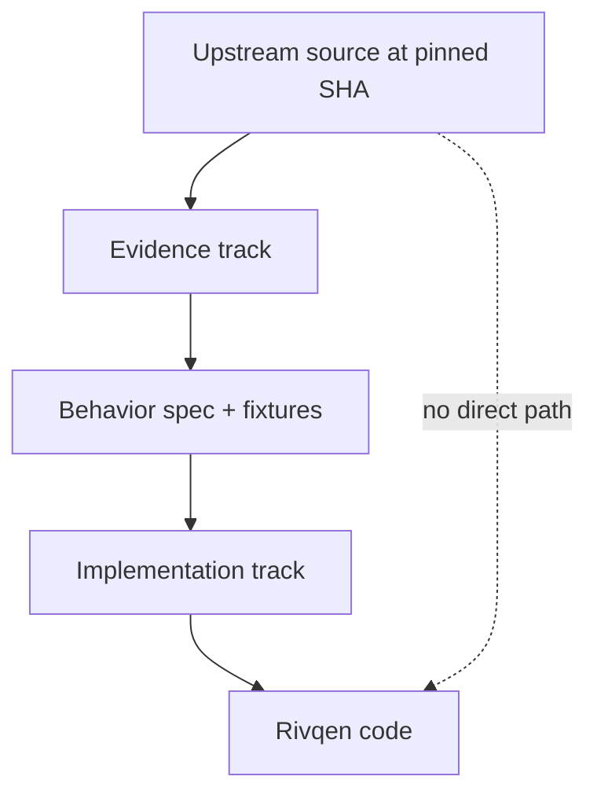

# Clean-room provenance

Rivqen re-implements the **behavior** of the legacy protocol. It does not copy the **expression** (source code) of Tencent VasSonic. This page defines the rules that keep the two apart.

**Status:** <Badge type="danger" text="GATE" /> Mandatory for every contributor and every AI agent.

[[toc]]

## 1. Why clean room

Upstream VasSonic is BSD-3-Clause licensed, with some Android source code under Apache-2.0. Copying would be legally possible with notices, but a clean-room process gives Rivqen:

- A clear, single license for all its code.
- No inherited design defects from 2017–2019 code.
- A specification that is independent of any one implementation.
- A simple answer to provenance questions from integrators and auditors.

## 2. Two tracks

| Track | Who | Reads upstream code? | Produces |
|---|---|---|---|
| **Evidence** | Source archaeologist (human or agent) | Yes | Behavior descriptions in own words, file:line references, captured traces, fixtures |
| **Implementation** | Core, platform and server engineers | **No**, they work from the spec and fixtures | Rivqen code |

Where the same person must work in both tracks (small team), they follow the rules in section 3 strictly and record it in the PR.

## 3. Rules

| ID | Rule |
|---|---|
| CR-01 | Do not copy, translate, or port upstream source code into Rivqen. Not even "small" helpers. |
| CR-02 | Evidence documents describe behavior in your own words. They cite `upstream:<path>:<line>` at the pinned SHA. |
| CR-03 | Allowed to quote: header names and values, constant names and values, marker strings, regular expressions that define the wire grammar, JSON key names, result codes. These are interface facts needed for interoperability. |
| CR-04 | Do not reuse upstream comments, identifiers of internal (non-protocol) functions as code names, file structure or test code. |
| CR-05 | Do not reuse upstream images, logos, diagrams or the PDF. |
| CR-06 | Implementation work cites the spec section and fixture, not upstream files. |
| CR-07 | AI agents get the spec and fixtures as input for implementation tasks, not upstream code. |
| CR-08 | Before each release, run a code-similarity scan against the upstream repository and review all hits. |

## 4. Records

| Record | Location |
|---|---|
| Pinned upstream SHA and file hashes | `evidence/source-manifest.lock` (WP-01) |
| Studied files list | `evidence/source-manifest.lock` |
| Evidence documents | [Protocol pages](/engineering/protocol/) and [Upstream audit](/research/upstream-vassonic) |
| Similarity scan results | Release audit (WP-21) |

## 5. If upstream material is ever needed

If the maintainers decide to include upstream material (for example a test asset), they must:

1. Record the decision in an ADR.
2. Keep the original copyright and BSD-3-Clause notice next to the material.
3. Add it to `THIRD_PARTY_NOTICES.md`.
4. Add SPDX tags for the original license to those files.
